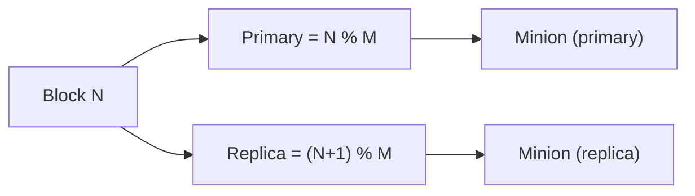

# RAID01 Manager

**Phase:** 2 | **Effort:** 12 hrs | **Status:** ❌ Not implemented

**Files:**
- `services/storage/include/RAID01Manager.hpp`
- `services/storage/src/RAID01Manager.cpp`

---

## Responsibility

RAID01Manager is the **brain of storage distribution**. It knows which minions are healthy, and for any given block number it returns the two minion IDs that should hold that block (primary + replica).

It does not do any networking — that is MinionProxy's job. It is purely a mapping and state-tracking component.

---

## Interface

```cpp
class RAID01Manager {
public:
    // Returns {primary_id, replica_id}
    std::pair<int, int> GetBlockLocation(uint64_t block_num);

    void AddMinion(int id, const std::string& ip, int port);
    void FailMinion(int id);
    void RecoverMinion(int id);

    std::string GetMinionIP(int id) const;
    int         GetMinionPort(int id) const;

    void SaveMapping(const std::string& path);
    void LoadMapping(const std::string& path);

private:
    std::map<int, Minion> minions_;
};
```

---

## Block Mapping Algorithm

```
Block N is stored on:
  primary = N % num_healthy_minions
  replica = (N + 1) % num_healthy_minions

Example: 4 minions, block 7:
  primary = 7 % 4 = 3  → Minion 3
  replica = 8 % 4 = 0  → Minion 0
```



---

## Failure Handling

When a minion fails, `GetBlockLocation` skips it and uses the next healthy minion:

```
Normal (M0-M3 all healthy): Block 0 → M0, M1
Minion M0 fails:            Block 0 → M1 (was replica, now primary)
                                      M2 (next healthy)
```

---

## Data Structures

```cpp
struct Minion {
    int         id;
    std::string ip;
    int         port;
    enum Status { HEALTHY, DEGRADED, FAILED } status;
    time_t      last_response_time;
};
```

---

## Related Notes
- [[RAID01 Explained]]
- [[Watchdog]]
- [[AutoDiscovery]]
- [[MinionProxy]]
- [[Phase 2 - Data Management & Network]]
