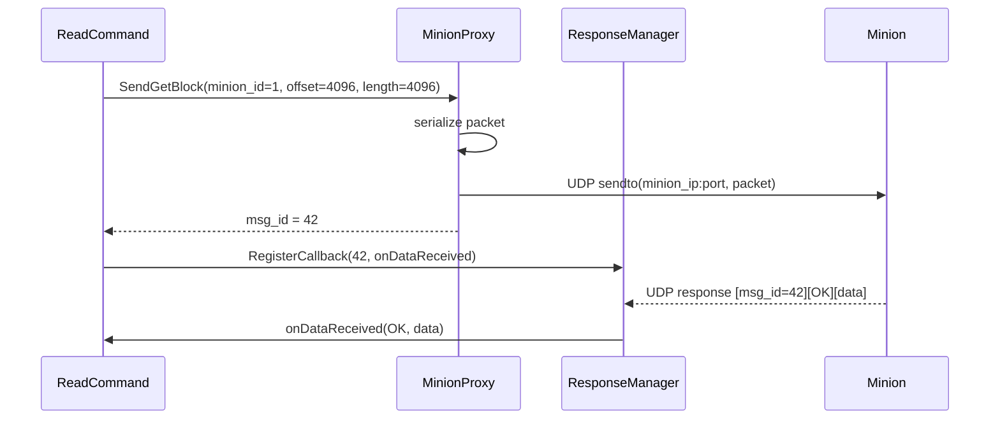

# MinionProxy

**Phase:** 2 | **Effort:** 14 hrs | **Status:** ❌ Not implemented

**Files:**
- `services/network/include/MinionProxy.hpp`
- `services/network/src/MinionProxy.cpp`

---

## Responsibility

MinionProxy is the **network abstraction layer** for minion communication. Commands call it to send GET/PUT requests to a specific minion. It serializes the message, sends it via UDP, and returns a unique MSG_ID. It never waits for responses — that is ResponseManager's job.

---

## Interface

```cpp
class MinionProxy {
public:
    MinionProxy(RAID01Manager& raid);

    // Returns MSG_ID (used to match response later)
    uint32_t SendGetBlock(int minion_id, uint64_t offset, uint32_t length);
    uint32_t SendPutBlock(int minion_id, uint64_t offset,
                          const char* data, uint32_t length);
    uint32_t SendDeleteBlock(int minion_id, uint64_t offset);

private:
    uint32_t NextMsgId();
    void     Send(int minion_id, const std::vector<char>& packet);

    RAID01Manager& raid_;
    int            sock_fd_;
    std::atomic<uint32_t> msg_counter_{0};
};
```

---

## Wire Protocol

```
Master → Minion:
  Offset  Size  Field
  0       4     MSG_ID   (unique per request)
  4       1     OP_TYPE  (0=GET, 1=PUT, 2=DELETE)
  5       8     OFFSET   (byte offset in block space)
  13      4     LENGTH   (data length)
  17      var   DATA     (only for PUT)

Minion → Master:
  Offset  Size  Field
  0       4     MSG_ID   (same as request)
  4       1     STATUS   (0=OK, 1=ERROR)
  5       4     LENGTH   (data length)
  9       var   DATA     (only for GET response)
```

---

## Sequence Diagram



---

## Why UDP (not TCP)?

See [[Why UDP not TCP]] for full reasoning. Short version:
- Lower latency (no connection setup)
- LDS implements its own retry logic via Scheduler
- Fire-and-forget matches the async response pattern
- Simple to multicast for replication

---

## Related Notes
- [[ResponseManager]]
- [[Scheduler]]
- [[RAID01 Manager]]
- [[Why UDP not TCP]]
- [[Phase 2 - Data Management & Network]]
