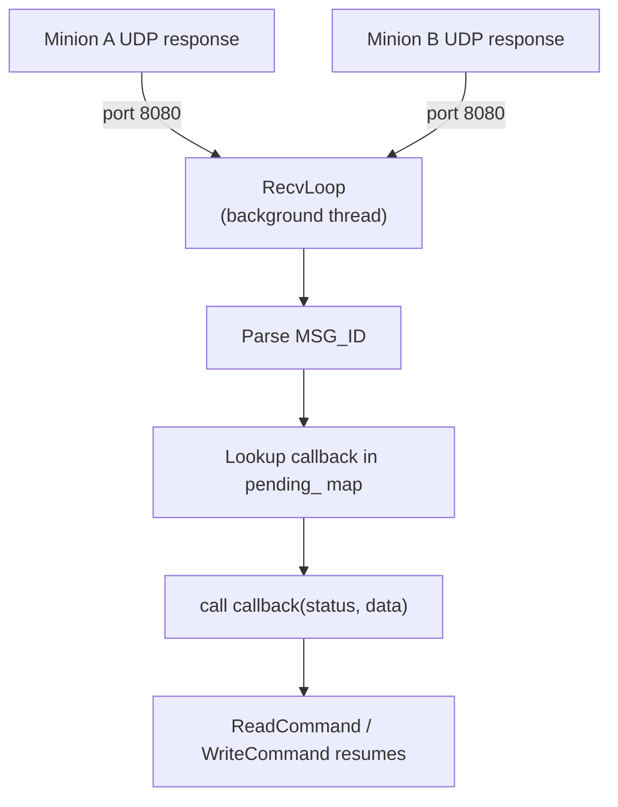

# ResponseManager

**Phase:** 2 | **Effort:** 10 hrs | **Status:** ❌ Not implemented

**Files:**
- `services/network/include/ResponseManager.hpp`
- `services/network/src/ResponseManager.cpp`

---

## Responsibility

ResponseManager listens on a UDP port for minion responses, parses the MSG_ID from each packet, and calls the registered callback for that request. It is the **async reply handler** — the other half of MinionProxy's fire-and-forget sends.

---

## Interface

```cpp
class ResponseManager {
public:
    void Start(int listen_port);
    void Stop();

    void RegisterCallback(uint32_t msg_id,
                          std::function<void(Status, Buffer)> callback);
    void UnregisterCallback(uint32_t msg_id);

private:
    void RecvLoop();   // runs in background thread

    int                                            sock_fd_;
    std::thread                                    recv_thread_;
    std::unordered_map<uint32_t, Callback>         pending_;
    std::mutex                                     mutex_;
    std::atomic<bool>                              running_{false};
};
```

---

## Flow



---

## Thread Safety

The `pending_` map is shared between:
- The main thread (registers/unregisters callbacks via commands)
- The RecvLoop thread (looks up and calls callbacks)

A `std::mutex` guards all access. Callbacks are erased after being called (one-shot).

---

## Interaction with Scheduler

ResponseManager calls `Scheduler::OnResponse(msg_id)` when a response arrives, so the Scheduler cancels the pending timeout:

```cpp
void ResponseManager::OnPacketReceived(uint32_t msg_id, Status s, Buffer data) {
    scheduler_.OnResponse(msg_id);   // cancel timeout
    auto cb = pending_.at(msg_id);
    pending_.erase(msg_id);
    cb(s, data);                     // notify command
}
```

---

## Related Notes
- [[MinionProxy]]
- [[Scheduler]]
- [[Phase 2 - Data Management & Network]]
