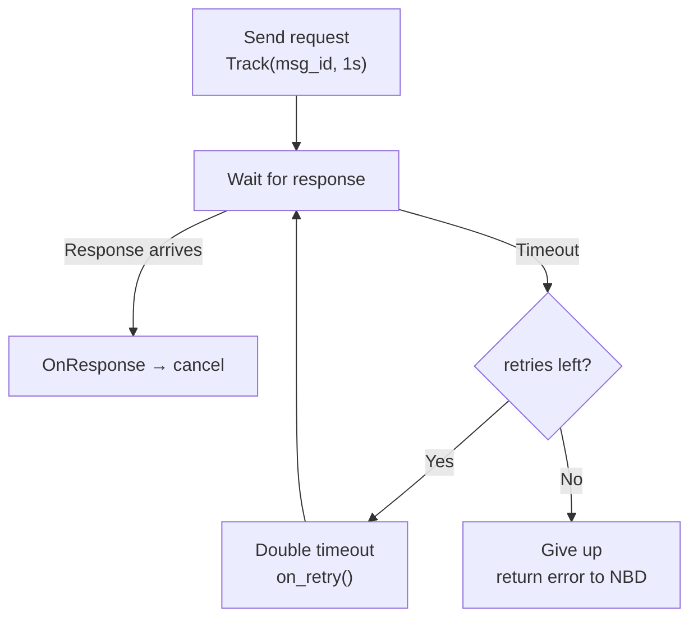

# Scheduler

**Phase:** 2 | **Status:** ✅ C implementation done — C++ LDS integration pending

**C implementation (done):**
- `Igit/ds/src/scheduler.c`
- `Igit/ds/include/scheduler.h`

**LDS C++ integration (planned):**
- `services/execution/include/Scheduler.hpp`
- `services/execution/src/Scheduler.cpp`

---

## Two Distinct Concepts — Read This First

The name "Scheduler" refers to two different things in this project:

| | C Scheduler (done) | LDS Retry Scheduler (planned) |
|---|---|---|
| **Purpose** | Run tasks at time intervals | Track pending UDP requests + retry on timeout |
| **Interface** | `SchedAddTask(fn, param, interval_sec)` | `Track(msg_id, timeout, on_retry)` |
| **Used by** | Watchdog (internally) | ResponseManager, MinionProxy |
| **Status** | ✅ Built + tested | ❌ Not yet implemented |

The C Scheduler is a **foundation** — the LDS Watchdog ping loop can be built on top of it.

---

## C Scheduler — What's Already Built

**Location:** `Igit/ds/src/scheduler.c` (reviewed, October 2025)

A general-purpose time-ordered task runner. Internally uses a heap priority queue sorted by `time_to_run`. Tasks are identified by UIDs.

**API:**
```c
sched_ty* SchedulerCreate(void);
uid_ty    SchedAddTask(sched_ty*, int(*fn)(void*), void* param, size_t interval_sec);
int       SchedRun(sched_ty*);     // blocks: runs tasks in time order
void      SchedStop(sched_ty*);
int       SchedRemoveTask(sched_ty*, uid_ty);
void      SchedDestroy(sched_ty*);
```

**Task return values:**
- `REPEAT (0)` — reschedule after interval
- `NOT_REPEAT (1)` — run once and remove
- `FAILURE (-1)` — stop the scheduler

**How `SchedRun()` works:**
```
loop:
  pop earliest task from heap PQ
  sleep until task->time_to_run
  run task->fn(param)
  if REPEAT → update time_to_run, push back into PQ
  if NOT_REPEAT or FAILURE → destroy task
```

**What makes it interesting for an interview:**
- Clean abstraction layer (DSCreate/DSInsert/DSRemove) separates the scheduler from the underlying heap PQ
- Self-removal during execution handled via `remove_current` flag — prevents reentrancy bug
- UID-based task identity (not pointer-based) — safe even if the task reallocates

---

---

## Responsibility

The Scheduler tracks pending requests and re-sends them if no response arrives within a deadline. It implements **exponential backoff retry** so transient network issues don't immediately cause failures.

---

## Interface

```cpp
class Scheduler {
public:
    // Register a pending request. On timeout: call on_timeout()
    void Track(uint32_t msg_id,
               std::chrono::milliseconds timeout,
               std::function<void()> on_retry,
               int max_retries = 3);

    // Called by ResponseManager when a response arrives
    void OnResponse(uint32_t msg_id);

    void Start();   // launches background poll thread
    void Stop();

private:
    void PollLoop();

    struct PendingRequest {
        uint32_t                   msg_id;
        std::chrono::steady_clock::time_point deadline;
        std::function<void()>      on_retry;
        int                        retries_left;
        std::chrono::milliseconds  current_timeout;
    };

    std::unordered_map<uint32_t, PendingRequest> pending_;
    std::mutex  mutex_;
    std::thread poll_thread_;
};
```

---

## Retry Logic

```
Attempt 1: send request → wait 1000ms
  Timeout → retry
Attempt 2: send request → wait 2000ms
  Timeout → retry
Attempt 3: send request → wait 4000ms
  Timeout → give up → return error to command

If response arrives at any point → cancel timer, success
```



---

## Exponential Backoff Parameters

| Attempt | Timeout |
|---|---|
| 1 | 1 000 ms |
| 2 | 2 000 ms |
| 3 | 4 000 ms |
| Max | give up |

Maximum total wait before giving up: ~7 seconds per request.

---

## Why Exponential Backoff?

- Avoids flooding a temporarily overloaded minion with rapid retries
- Allows network to recover from transient blips
- Bounds worst-case wait time (7s) so user doesn't hang forever
- Standard practice in distributed systems (TCP, HTTP, etc.)

---

## Related Notes
- [[MinionProxy]]
- [[ResponseManager]]
- [[Phase 2 - Data Management & Network]]
