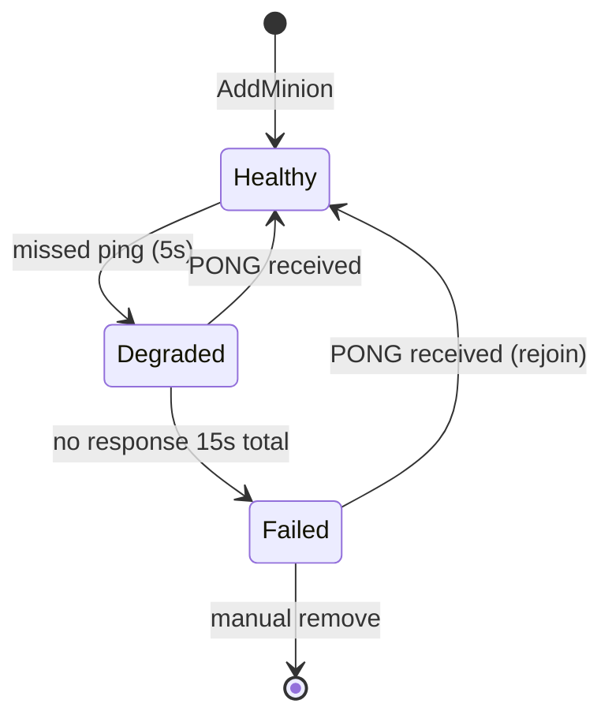
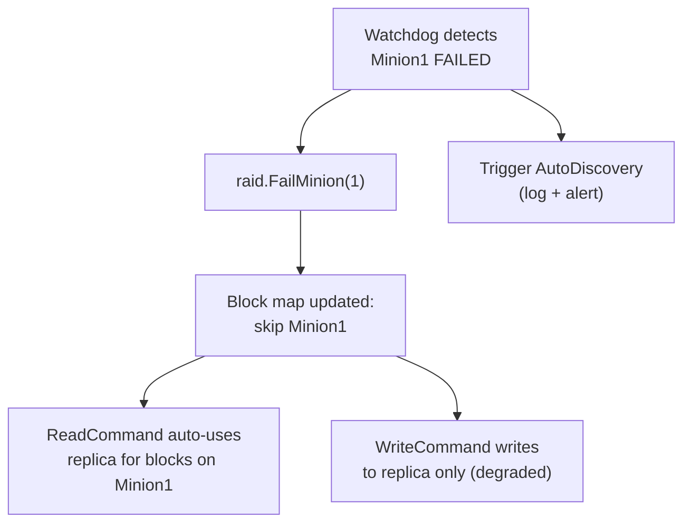

# Watchdog

**Phase:** 3 | **Status:** ✅ C implementation done — LDS minion health monitor pending

**C implementation (done):**
- `Igit/ds/src/wd.c`
- `Igit/ds/include/wd.h`

**LDS C++ integration (planned):**
- `services/health/include/Watchdog.hpp`
- `services/health/src/Watchdog.cpp`

---

## Two Distinct Concepts — Read This First

| | C Watchdog (done) | LDS Minion Watchdog (planned) |
|---|---|---|
| **Purpose** | Keep a **process** alive — resurrect if it crashes | Monitor **minion health** — detect FAILED minions |
| **Mechanism** | `fork()`/`exec()` + SIGUSR1/SIGUSR2 ping-pong | UDP PING/PONG to each minion |
| **On failure** | Kills and re-`exec()`s the dead process | Calls `raid.FailMinion(id)` |
| **API** | `MakeMeImmortal()` / `DoNotResuscitate()` | `Start()` / `Stop()` |
| **Status** | ✅ Built + tested | ❌ Not yet implemented |

The C Watchdog could protect the **LDS master process** itself. The LDS Minion Watchdog monitors remote minions.

---

## C Watchdog — What's Already Built

**Location:** `Igit/ds/src/wd.c` (October 2025)

A process-level resurrection watchdog. Calling `MakeMeImmortal()` spawns a background thread (`Watchdog_TF`) that forks a dedicated watchdog executable. The main process and the watchdog process ping each other every N seconds via SIGUSR1. If either side misses too many pings, it kills and respawns the other.

**API:**
```c
// Call at startup. Blocks until watchdog process is confirmed running.
// argv[0] must be the path to the watchdog executable.
int MakeMeImmortal(int argc, char** argv, int max_miss, int interval, char* log_file);

// Call at shutdown. Blocks until watchdog has cleanly terminated.
int DoNotResuscitate(void);
```

**Internal state machine:**

```
ToInit   → adds scheduler tasks: IncCnt, FirstSignal, CheckCnt, CheckTerm
              ↓ first SIGUSR1 received from watchdog process
ToWatch  → adds: SendSignal, IncCnt, CheckCnt, CheckTerm
              ↓ g_cnt > max_miss (missed too many pings)
ToRevive → kills watchdog PID, fork/exec a new one, adds FirstSignalAfterRevive
              ↓ DoNotResuscitate() called
ToTerm   → adds ReleaseResuscitate task (sends SIGUSR2 to watchdog), SchedStop
```

**What makes it interesting for an interview:**
- Uses the C Scheduler internally — watchdog runs its entire logic as scheduler tasks
- Thread safety: `sig_atomic_t` for signal handler ↔ thread communication, `sem_t` for main ↔ watchdog thread synchronization
- `pthread_detach` — fire-and-forget thread, no need to join
- `sem_timedwait` with timeout — avoids hanging forever if thread fails
- Signal masking: SIGUSR1/SIGUSR2 blocked in main thread, unblocked only in watchdog thread
- Self-recovery: if watchdog process disappears (killed externally), the thread detects and respawns it

---

## LDS Minion Watchdog — Planned Responsibility

The LDS-specific watchdog runs in a background thread and periodically PINGs every registered minion over UDP. If a minion stops responding, it marks it FAILED in the RAID01Manager so reads/writes are automatically rerouted.

---

## Interface

```cpp
class Watchdog {
public:
    Watchdog(RAID01Manager& raid, MinionProxy& proxy);
    void Start();
    void Stop();

private:
    void MonitorLoop();
    void PingMinion(int id);
    void OnPongReceived(int minion_id);
    void CheckTimeouts();

    RAID01Manager& raid_;
    MinionProxy&   proxy_;
    std::thread    monitor_thread_;
};
```

---

## Timing Parameters

| Parameter | Value |
|---|---|
| Ping interval | 5 seconds |
| DEGRADED threshold | 1 missed ping |
| FAILED threshold | 15 seconds no response |
| Recovery: on first PONG | HEALTHY |

---

## State Machine



---

## What Happens on Failure



---

## Ping Packet Format

```
Master → Minion:
  [MSG_TYPE=PING : 1 byte]
  [TIMESTAMP    : 8 bytes]

Minion → Master:
  [MSG_TYPE=PONG : 1 byte]
  [TIMESTAMP    : 8 bytes]  (echo back for RTT calculation)
```

---

## Related Notes
- [[RAID01 Manager]]
- [[AutoDiscovery]]
- [[RAID01 Explained]]
- [[Phase 3 - Reliability Features]]
