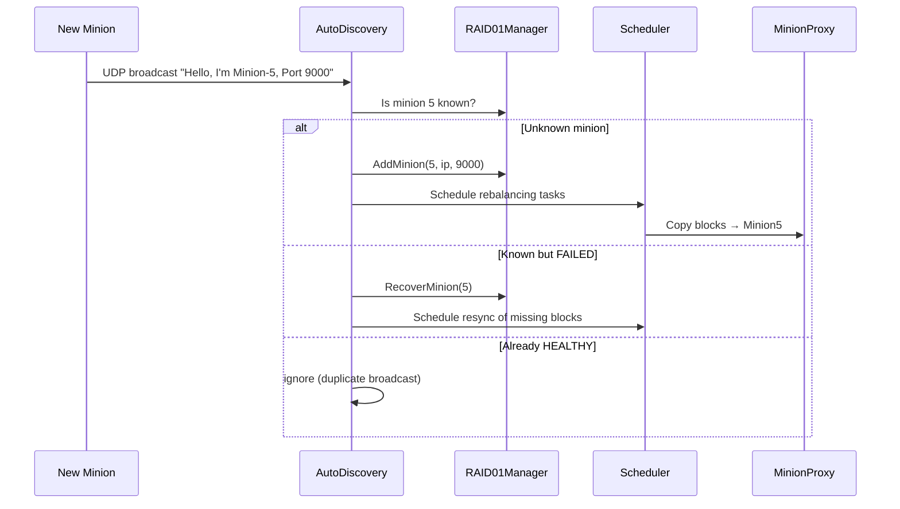

# AutoDiscovery

**Phase:** 3 | **Effort:** 10 hrs | **Status:** ❌ Not implemented

**Files:**
- `services/discovery/include/AutoDiscovery.hpp`
- `services/discovery/src/AutoDiscovery.cpp`

---

## Responsibility

AutoDiscovery listens for UDP broadcasts from minions announcing themselves. When a new or previously-failed minion appears, it registers it with the RAID01Manager and triggers data rebalancing so the new minion receives its share of blocks.

---

## Interface

```cpp
class AutoDiscovery {
public:
    explicit AutoDiscovery(RAID01Manager& raid, Scheduler& scheduler);
    void Start(int broadcast_port = 8888);
    void Stop();

private:
    void ListenLoop();
    void HandleHello(const HelloPacket& pkt, const sockaddr_in& from);
    void RebalanceForNewMinion(int new_minion_id);

    RAID01Manager& raid_;
    Scheduler&     scheduler_;
    std::thread    listen_thread_;
};
```

---

## Discovery Flow



---

## Hello Packet Format

```
Minion → Broadcast (UDP port 8888):
  [MSG_TYPE  : 1 byte]   = 0xFF (HELLO)
  [MINION_ID : 4 bytes]
  [PORT      : 2 bytes]
  [CAPACITY  : 8 bytes]   (bytes of storage available)
```

Minions broadcast every 5 seconds until they receive an acknowledgement.

---

## Rebalancing Logic

When a new minion (ID = N) joins a cluster of M minions:

```
For each block B (0 to MAX_BLOCKS):
  old_primary = B % M
  new_primary = B % (M+1)

  if new_primary == N:
    copy block B from old_primary to Minion N
    update block_map[B] = (N, replica)
```

This is done asynchronously via Scheduler — the system keeps serving reads/writes during rebalancing.

---

## Related Notes
- [[Watchdog]]
- [[RAID01 Manager]]
- [[Scheduler]]
- [[Phase 3 - Reliability Features]]
