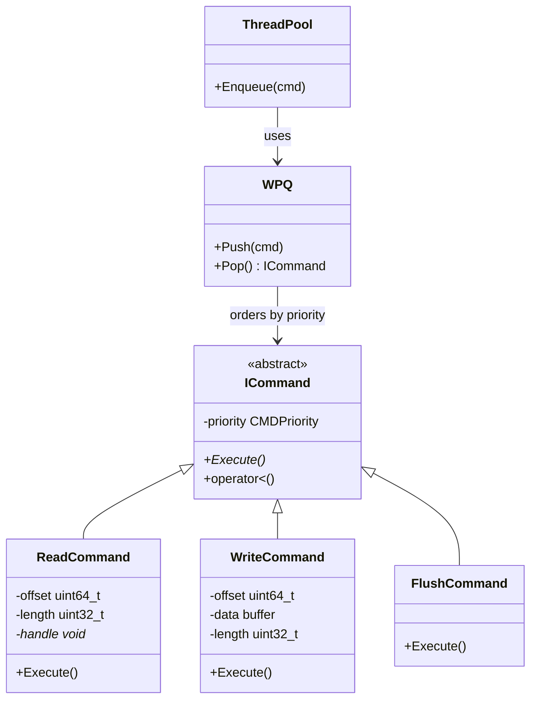
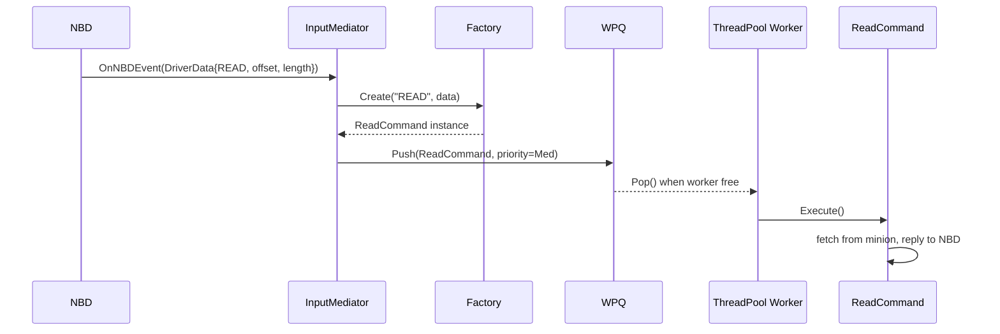

# Command Pattern

## Purpose

Encapsulate a **request as an object** with priority, so it can be queued, scheduled, and executed by a worker thread.

Mental model: a **restaurant order ticket** — the order is an object describing what to make, its priority (VIP vs regular), and how to execute it. The kitchen (ThreadPool) picks up tickets in order.

---

## Status in Project

✅ **ICommand base class implemented** — `design_patterns/command/include/ICommand.hpp`

❌ **ReadCommand, WriteCommand** — to implement in Phase 1

---

## Interface

```cpp
// design_patterns/command/include/ICommand.hpp

class ICommand {
public:
    enum CMDPriority { Low = 0, Med = 1, High = 2, Admin = 3 };

    explicit ICommand(CMDPriority priority = Med);
    virtual ~ICommand() = default;

    virtual void Execute() = 0;

    bool operator<(const ICommand& rhs) const;   // for WPQ sorting

private:
    CMDPriority priority_;
};
```

---

## Priority Levels in LDS

| Priority | Level | Used For |
|---|---|---|
| `Admin` | 3 (highest) | System-critical (flush, shutdown) |
| `High` | 2 | WRITE operations (data integrity) |
| `Med` | 1 | READ operations |
| `Low` | 0 | Background tasks |

---

## ReadCommand

```cpp
// services/commands/include/ReadCommand.hpp  (to implement)

class ReadCommand : public ICommand {
public:
    ReadCommand(uint64_t offset, uint32_t length, void* nbd_handle,
                RAID01Manager& raid, MinionProxy& proxy)
        : ICommand(Med), offset_(offset), length_(length),
          handle_(nbd_handle), raid_(raid), proxy_(proxy) {}

    void Execute() override {
        auto [primary, replica] = raid_.GetBlockLocation(offset_ / BLOCK_SIZE);
        auto msg_id = proxy_.SendGetBlock(primary, offset_, length_);
        // ResponseManager calls back with data
        // On timeout: retry with replica
        // On success: nbd_reply(handle_, data, length_)
    }
private:
    uint64_t offset_;
    uint32_t length_;
    void*    handle_;
    RAID01Manager& raid_;
    MinionProxy&   proxy_;
};
```

---

## WriteCommand

```cpp
// services/commands/include/WriteCommand.hpp  (to implement)

class WriteCommand : public ICommand {
public:
    WriteCommand(uint64_t offset, const char* data, uint32_t length,
                 void* nbd_handle, RAID01Manager& raid, MinionProxy& proxy)
        : ICommand(High), ...

    void Execute() override {
        auto [primary, replica] = raid_.GetBlockLocation(offset_ / BLOCK_SIZE);
        proxy_.SendPutBlock(primary, offset_, data_, length_);   // fire
        proxy_.SendPutBlock(replica, offset_, data_, length_);   // fire
        // Wait for at least 1 ACK
        // nbd_reply(handle_, NBD_SUCCESS)
    }
};
```

---

## Class Diagram



---

## Flow: NBD Event → Execution



---

## Benefits of Command Pattern

| Benefit | Detail |
|---|---|
| **Queuing** | Commands sit in WPQ until a worker thread is free |
| **Prioritization** | WRITE before READ via operator< |
| **Decoupling** | InputMediator doesn't know what ReadCommand does |
| **Testability** | Execute() can be called in isolation with mocks |
| **Logging/Auditing** | Wrap Execute() to log every operation |

---

## Related Notes
- [[InputMediator]]
- [[Factory]]
- [[Reactor]]
- [[Phase 1 - Core Framework Integration]]

---

## Detailed Implementation Reference

*Source: `design_patterns/command/README.md`*

### Pattern Overview

**Purpose**: Encapsulate a request as an object, allowing parameterization of clients with different requests, queueing, and logging.

**Problem It Solves**:
- How to decouple command invokers from command executors?
- How to queue, schedule, or log commands?
- How to support undo/redo operations?
- How to parameterize methods with different arguments?

**Real-World Analogy**: Like a restaurant - a waiter (invoker) takes orders (commands) from customers and gives them to the chef (executor). The order is a request object that encapsulates what needs to be done.

### Core Component: ICommand Interface

```cpp
template <typename Args, typename Return>
class ICommand {
public:
    virtual ~ICommand() = default;
    virtual Return execute(const Args& args) = 0;
    virtual std::string getName() const { return "Command"; }
};
```

### Usage Example

```cpp
struct QueryArgs { std::string sql; int timeout; };
struct QueryResult { bool success; std::string data; };

class ExecuteQueryCommand : public ICommand<QueryArgs, QueryResult> {
public:
    QueryResult execute(const QueryArgs& args) override {
        return QueryResult{true, "Query results..."};
    }
};
```

### Integration in Local Cloud

- **Phase 1**: ThreadPool executes commands
- **Phase 3**: RPC invocation - deserialize to Command → execute → return result

### Integration with Other Patterns

```cpp
// Command + Factory
ICommand<Args, Result>* cmd = factory.create("QueryCommand");

// Command + ThreadPool
ThreadPool pool(4);
pool.enqueue([cmd, args]() { Result result = cmd->execute(args); });
```

### Common Use Cases

| Use Case | Implementation |
|----------|----------------|
| Task queuing | CommandQueue with FIFO |
| RPC invocation | Command with serialized args |
| Undo/redo | UndoableCommand with history |
| Scheduled tasks | Command with delay/interval |
| Macros | CompositeCommand |
| Transactions | Command that bundles operations |

**Status**: ✅ Fully implemented and tested | **Used By**: ThreadPool task execution, Phase 3 RPC framework
