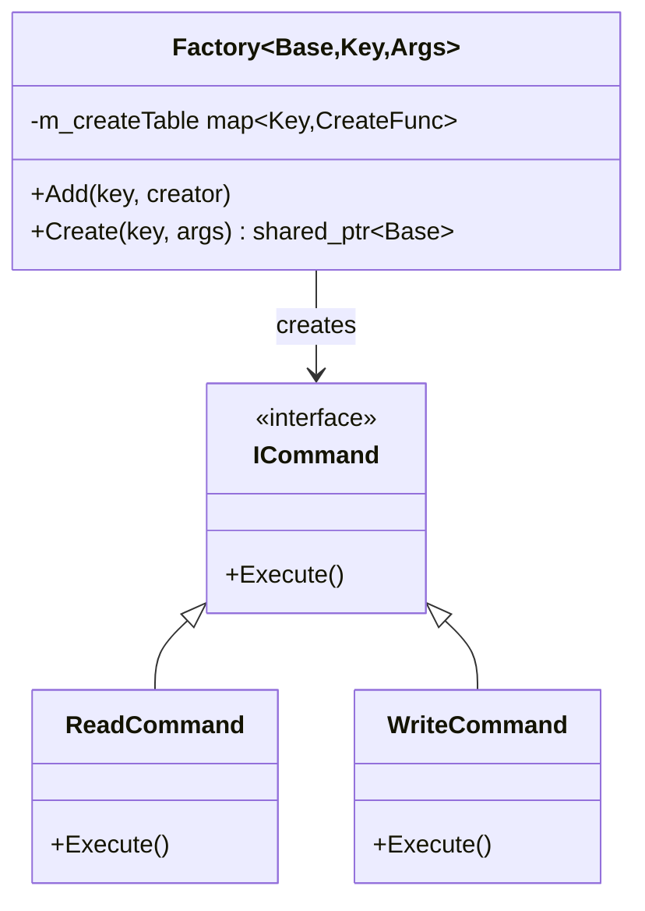

# Factory Pattern

## Purpose

Create objects **by name** at runtime without hardcoding class names. Plugins and commands register themselves; callers just ask by key.

Mental model: a **vending machine** — you press "Coke" and get a Coke without knowing how it was made.

---

## Status in Project

✅ **Already implemented** — `design_patterns/factory/include/factory.hpp`

Used by: **Plugin system** (PNP registers plugins), **InputMediator** (creates ReadCommand / WriteCommand by type string)

---

## Interface

```cpp
// design_patterns/factory/include/factory.hpp

template <typename Base, typename Key, typename Args>
class Factory {
public:
    using CreateFunc = std::function<std::shared_ptr<Base>(Args args)>;

    void Add(const Key& key, CreateFunc creator);
    std::shared_ptr<Base> Create(const Key& key, Args& args);

private:
    std::unordered_map<Key, CreateFunc> m_createTable;
};
```

### Template Parameters

```
Factory<ReturnType, KeyType, ArgsType>
          │             │         │
          │             │         └─ What creator functions take as input
          │             └─ How objects are looked up (usually string)
          └─ Base class / interface of objects created
```

---

## How to Use — 3 Steps

### Step 1: Define factory type

```cpp
using CommandFactory = Factory<ICommand, std::string, DriverData>;
```

### Step 2: Register creators (at app startup or in plugin constructor)

```cpp
auto& factory = *Singleton<CommandFactory>::GetInstance();

factory.Add("READ",  [](DriverData d) { return std::make_shared<ReadCommand>(d); });
factory.Add("WRITE", [](DriverData d) { return std::make_shared<WriteCommand>(d); });
factory.Add("FLUSH", [](DriverData d) { return std::make_shared<FlushCommand>(d); });
```

### Step 3: Create by name (at runtime)

```cpp
std::string op = (request.type == READ) ? "READ" : "WRITE";
auto cmd = factory.Create(op, request);
thread_pool.Enqueue(cmd);
```

---

## Class Diagram



---

## Plugin Self-Registration

Plugins register themselves in their static constructor — so loading the `.so` is enough:

```cpp
// Inside SamplePlugin.cpp (runs automatically when dlopen loads it)
__attribute__((constructor)) void register_plugin() {
    auto& factory = *Singleton<PluginFactory>::GetInstance();
    factory.Add("SamplePlugin", [](std::nullptr_t) {
        return std::make_shared<std::function<void()>>(&SamplePlugin::main);
    });
}
```

---

## Benefits

| Benefit                  | Why it matters                                  |
| ------------------------ | ----------------------------------------------- |
| Runtime registration     | Plugins add types without changing core code    |
| No hardcoded class names | InputMediator doesn't know ReadCommand exists   |
| Extensibility            | Add new command types without modifying factory |
| Testability              | Swap in fake implementations during tests       |

---

## Related Notes
- [[Singleton]]
- [[Command]]
- [[InputMediator]]
- [[PNP]]

---

## Detailed Implementation Reference

*Source: `design_patterns/factory/README.md`*

### Pattern Overview

**Purpose**: Provide an interface for creating objects without specifying their exact classes.

**Problem It Solves**:
- How to create objects without hardcoding types?
- How to decouple object creation from usage?
- How to enable runtime object creation and registration?
- How to allow plugins to self-register?

### Core Components

```cpp
template <typename T>
class Factory {
public:
    static Factory& getInstance();
    void registerType(const std::string& name, std::function<T*()> creator);
    T* create(const std::string& name);
    std::vector<std::string> listTypes();
};
```

### Plugin Self-Registration

```cpp
class MyPlugin {
public:
    MyPlugin() {
        PluginFactory::getInstance()
            .registerType("MyPlugin", []{ return new MyPlugin(); });
    }
};

// Auto-registration on plugin load
__attribute__((constructor)) void init_plugin() {
    new MyPlugin();  // Constructor registers it
}
```

### Pattern Flow

```
1. Registration (happens once)
   Constructor → registerType("Name", creator_function) → Factory stores entry

2. Creation (runtime)
   create("Name") → Lookup entry → Call creator_function → Return new object

3. Discovery (query)
   listTypes() → Return all registered type names
```

### Key Design Decisions

- **Singleton Factory**: single global registry, one source of truth
- **Function Objects as Creators**: flexible (lambda, function pointer, std::function), can capture context
- **Explicit Registration**: simpler and safer than RTTI, works with plugins and dynamic loading

**Status**: ✅ Fully implemented and tested | **Used By**: Plugin system, all extensible components
