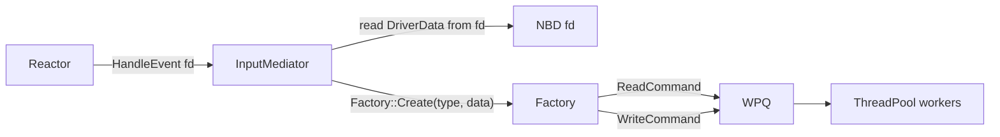

# InputMediator

**Phase:** 1 | **Effort:** 4 hrs | **Status:** ❌ Not implemented

**Files:**
- `services/mediator/include/InputMediator.hpp`
- `services/mediator/src/InputMediator.cpp`

---

## Responsibility

InputMediator is the **bridge between the Reactor and the command queue**. It receives raw NBD events from the Reactor, inspects the request type, creates the appropriate ICommand via Factory, and pushes it to the ThreadPool's WPQ.

It knows nothing about how reads or writes are actually executed — that is the Command's job.

---

## Interface

```cpp
class InputMediator : public IEventHandler {
public:
    explicit InputMediator(ThreadPool& pool,
                           RAID01Manager& raid,
                           MinionProxy& proxy,
                           Scheduler& scheduler);

    void HandleEvent(int fd) override;   // called by Reactor on NBD event

private:
    ThreadPool&     pool_;
    RAID01Manager&  raid_;
    MinionProxy&    proxy_;
    Scheduler&      scheduler_;
    Factory<ICommand, std::string, DriverData>& factory_;
};
```

---

## Flow



---

## Implementation Sketch

```cpp
void InputMediator::HandleEvent(int fd) {
    DriverData req;
    read(fd, &req, sizeof(req));   // read from NBD fd

    std::string type;
    switch (req.type) {
        case READ:  type = "READ";  break;
        case WRITE: type = "WRITE"; break;
        case FLUSH: type = "FLUSH"; break;
    }

    auto cmd = factory_.Create(type, req);
    pool_.Enqueue(std::move(cmd));
}
```

---

## Related Notes
- [[Reactor]]
- [[Factory]]
- [[Command]]
- [[NBD Layer]]
- [[Phase 1 - Core Framework Integration]]
