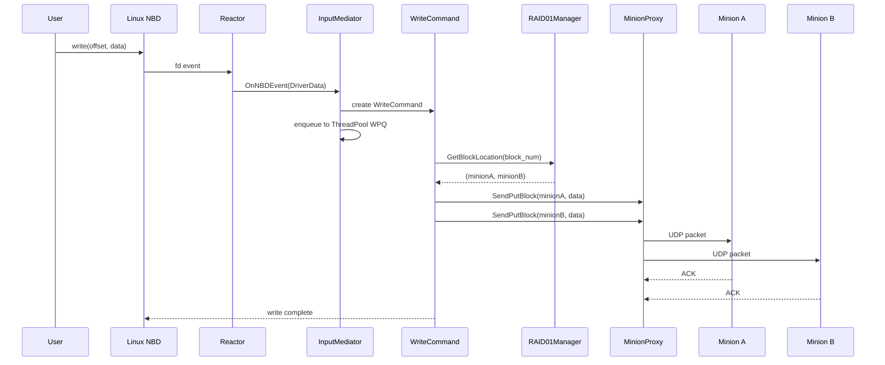
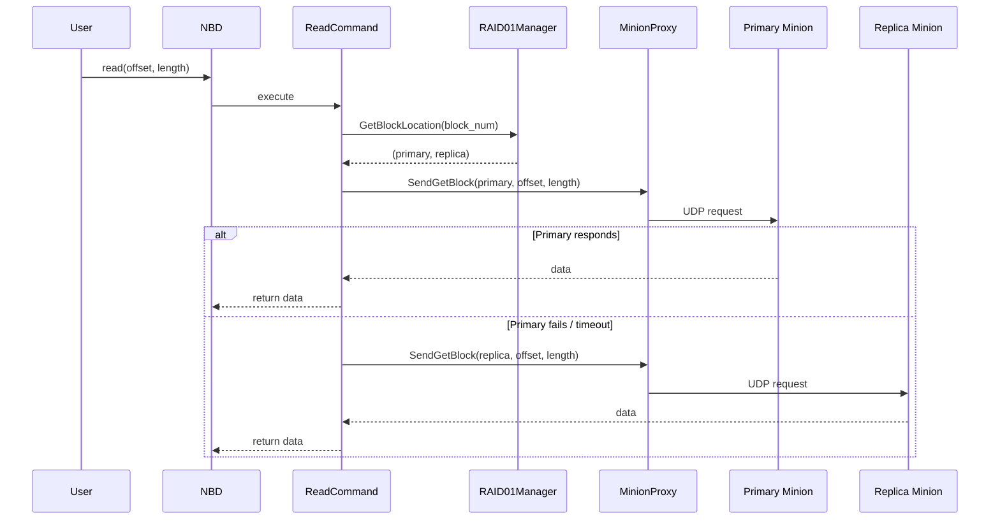

# System Overview — LDS Architecture

## What is LDS?

LDS (Local Drive Storage) is a distributed NAS (Network-Attached Storage) system built on top of Raspberry Pis acting as storage nodes. From the user's perspective it looks like a regular Linux disk — you can mount it and read/write files normally. Under the hood, data is split across multiple "minion" nodes with RAID01 redundancy.

---

## Master-Minion Model

```
┌───────────────────────────────────────────────┐
│                   MASTER NODE                 │
│                                               │
│  Linux NBD ──→ Reactor ──→ InputMediator      │
│                               │               │
│                         ThreadPool (WPQ)       │
│                               │               │
│              ┌────────────────┴──────────┐    │
│              │                           │    │
│         ReadCommand              WriteCommand  │
│              │                           │    │
│         RAID01Manager ←──────────────────┘    │
│              │                                │
│         MinionProxy ←──→ ResponseManager      │
│              │                                │
│         Scheduler (retry/timeout)             │
│              │                                │
│    Watchdog  │   AutoDiscovery               │
└──────────────┼────────────────────────────────┘
               │ UDP
    ┌──────────┼───────────────────┐
    │          │                   │
┌───▼───┐  ┌──▼────┐  ┌──────────▼┐
│Minion1│  │Minion2│  │ Minion N  │
│ RPi   │  │ RPi   │  │ RPi       │
└───────┘  └───────┘  └───────────┘
```

---

## How a Write Request Flows



---

## How a Read Request Flows



---

## Component Responsibilities (Summary)

| Component | Layer | Does What |
|---|---|---|
| **Reactor** | Core | epoll event loop — drives all I/O |
| **InputMediator** | Phase 1 | Converts NBD events → ICommand objects |
| **ThreadPool + WPQ** | Core | Executes commands concurrently with priority |
| **ReadCommand** | Phase 1 | Fetches block from primary (or replica) minion |
| **WriteCommand** | Phase 1 | Writes block to 2 minions (RAID01) |
| **RAID01Manager** | Phase 2 | Maps block numbers → (minionA, minionB) |
| **MinionProxy** | Phase 2 | UDP socket abstraction for each minion |
| **ResponseManager** | Phase 2 | Matches async UDP responses to pending requests |
| **Scheduler** | Phase 2 | Timeout tracking + exponential backoff retry |
| **Watchdog** | Phase 3 | Pings minions every 5s, marks failed after 15s |
| **AutoDiscovery** | Phase 3 | Listens for UDP broadcasts from new/rejoining minions |
| **MinionServer** | Phase 4 | Runs on each Raspberry Pi, handles GET/PUT/DELETE |

---

## Key Design Principles

1. **Non-blocking I/O** — Reactor + epoll handles thousands of connections without blocking threads
2. **Priority queuing** — Write (Admin) > Read (High) > Flush (Med) in the WPQ
3. **Fire-and-forget UDP** — MinionProxy sends and returns a MSG_ID; ResponseManager handles replies asynchronously
4. **RAID01** — Every block stored on exactly 2 minions; survives any single minion failure
5. **Plugin extensibility** — New functionality added as `.so` plugins, auto-loaded by DirMonitor + PNP

---

## Related Notes
- [[RAID01 Explained]]
- [[NBD Layer]]
- [[Class Diagram - Full System]]
- [[Reactor]]
