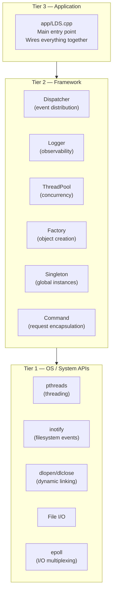

# Three-Tier Architecture

LDS is organized into three clean layers. Each tier depends only on the tier below it — never above.

---

## The Three Tiers



---

## Why This Matters

| Principle | Effect |
|---|---|
| **No upward dependencies** | Framework code never imports app code |
| **No cross-tier skipping** | App doesn't call `inotify` directly — it goes through DirMonitor |
| **Replaceability** | Swap LocalStorage for RAID01 without touching the Reactor |
| **Testability** | Each tier can be tested with mocks of the tier below |

---

## Tier 1 — OS / System APIs

Raw Linux capabilities. No abstraction. The code here speaks C and kernel.

| API | Used By | Why |
|---|---|---|
| `epoll` | Reactor | Scalable I/O multiplexing |
| `inotify` | DirMonitor | Filesystem event detection |
| `dlopen/dlclose` | Loader | Dynamic library loading |
| `pthreads` | ThreadPool | Native threading |
| `socketpair AF_UNIX` | NBDDriverComm | Kernel-userspace socket bridge |
| `ioctl(NBD_*)` | NBDDriverComm | NBD kernel protocol |
| `signalfd` | Reactor | Signal as epoll event |

---

## Tier 2 — Framework

Reusable components that wrap OS APIs and provide higher-level abstractions. No business logic here.

| Component | Wraps | Provides |
|---|---|---|
| `Dispatcher` + `CallBack` | — | Type-safe Observer pattern |
| `Logger` | `pthread_mutex` | Thread-safe structured logging |
| `ThreadPool` + `WPQ` | `pthreads` | Priority task execution |
| `Factory` | `unordered_map` | Runtime object creation by name |
| `Singleton` | `atomic` + `mutex` | Safe global instance |
| `ICommand` | — | Prioritized executable unit |
| `Reactor` | `epoll` | Event-driven I/O dispatch |

---

## Tier 3 — Application

`app/LDS.cpp` creates and wires the concrete components. It knows about everything but does almost nothing itself — it's pure composition.

```cpp
int main() {
    LocalStorage storage(size);         // Tier 2/3 component
    NBDDriverComm driver(device, size); // Tier 2/3 component
    Reactor reactor;                    // Tier 2 framework

    reactor.Add(driver.GetFD());
    reactor.SetHandler([&](int fd) {
        HandleRequest(driver, storage, reactor);
    });
    reactor.Run();
}
```

---

## Plugin System as a Vertical Slice

The plugin system cuts across all three tiers:

```
Tier 3 (App):   PNP wires DirMonitor + SoLoader
Tier 2 (Fw):    Dispatcher broadcasts events / Factory registers types
Tier 1 (OS):    inotify detects files / dlopen loads .so
```

This is by design — hot-loading needs OS primitives, framework event routing, and application orchestration together.

---

## Related Notes
- [[System Overview]]
- [[Reactor]]
- [[NBDDriverComm]]
