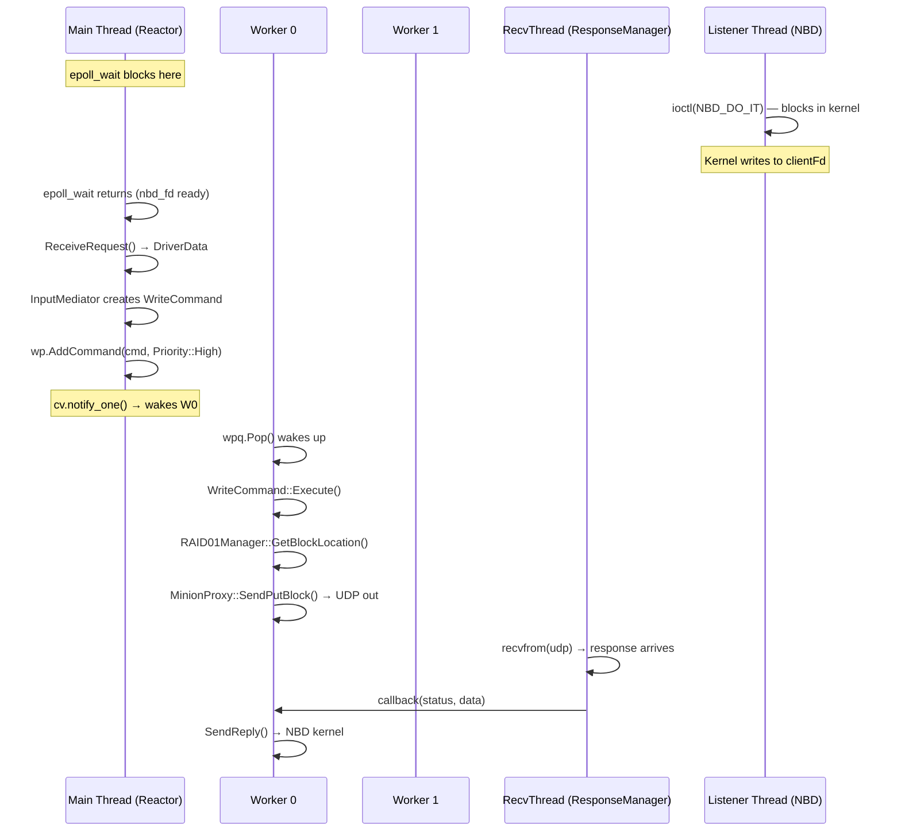

# Concurrency Model — All Threads, All Mutexes

This document is the authoritative map of everything that runs concurrently in LDS. A senior engineer must understand this to reason about races, deadlocks, and performance.

---

## Phase 1 Threads (Current State)

```
Process: LDS
│
├─ Main Thread
│   └─ Reactor::Run() — epoll_wait loop
│       └─ io_handler() — processes NBD requests synchronously
│
├─ NBDDriverComm::m_listener (m_listener thread)
│   └─ ioctl(NBD_DO_IT) — blocks forever in kernel
│       → forwards kernel I/O over socketpair
│
├─ NBDDriverComm::m_signal_thread (signal thread)
│   └─ sigwait({SIGINT, SIGTERM}) loop
│       → calls Disconnect() on signal
│
└─ DirMonitor background thread (unnamed)
    └─ read(inotify_fd) loop
        → NotifyAll(path) → SoLoader::OnLoad
```

**Concurrency in Phase 1 is minimal:** The main thread processes NBD requests one at a time. The listener thread is blocked in the kernel (does nothing useful). The signal thread sleeps in `sigwait`. The inotify thread only fires on filesystem events.

---

## Phase 2+ Threads (After ThreadPool Integration)

```
Process: LDS
│
├─ Main Thread
│   └─ Reactor::Run() — epoll loop
│       ├─ nbd_fd ready → InputMediator::HandleEvent()
│       │     → creates ReadCommand/WriteCommand
│       │     → tp.AddCommand(cmd)  [pushes to WPQ]
│       └─ udp_fd ready → ResponseManager dispatches callbacks
│
├─ Worker Thread 0..N-1  (ThreadPool)
│   └─ loop: cmd = wpq.Pop() → cmd->Execute()
│       └─ ReadCommand/WriteCommand
│             → RAID01Manager::GetBlockLocation()
│             → MinionProxy::SendGetBlock/SendPutBlock (UDP)
│
├─ NBDDriverComm::m_listener
│   └─ ioctl(NBD_DO_IT) — kernel I/O relay (still blocked)
│
└─ ResponseManager receiver thread
    └─ recvfrom(udp_fd) loop
        → looks up callback by MSG_ID
        → calls callback (on THIS thread, not main thread)
```

---

## Synchronization Map

| Shared State | Protected By | Threads That Touch It |
|---|---|---|
| `WPQ::m_pq` | `WPQ::m_mutex` + `WPQ::m_cv` | Main thread (Push), Worker threads (Pop) |
| `Dispatcher::m_subs` | ❌ **No mutex (Bug #8)** | inotify thread (Register), inotify thread (NotifyAll) |
| `LocalStorage::m_storage` | ❌ **No mutex (Bug #9)** | Worker threads (Read/Write concurrently) |
| `ThreadPool::m_cv` | `ThreadPool::m_mutex` (static!) | All workers across ALL pools (Bug #10) |
| `RAID01Manager::minions_` | `std::mutex` (Phase 2, not yet built) | Workers, Watchdog, AutoDiscovery |
| `ResponseManager::pending_` | `std::mutex` (Phase 2) | Main thread (register), RecvThread (lookup) |
| `Logger` output | `Logger::m_mutex` | All threads |
| `Singleton::s_instance` | `std::atomic` + `s_mutex` | All threads (one-time init) |

---

## Thread Interaction Diagram



---

## The Static Bug Explained (Bug #10)

```cpp
// thread_pool.hpp — WRONG
class ThreadPool {
    static std::mutex              m_mutex;  // shared across ALL instances
    static std::condition_variable m_cv;     // shared across ALL instances
};
```

```
Timeline with two pools:
tp1 created (4 workers) → workers block on tp1's WPQ via static m_cv
tp2 created (4 workers) → workers block on tp2's WPQ via same static m_cv

tp2.Resume() → m_cv.notify_all() → wakes ALL 8 workers
→ tp1's workers think they were resumed, exit suspension
→ unintended behavior
```

**Fix:** Remove `static`. Each `ThreadPool` needs its own mutex and condition variable.

---

## Thread Safety of `WPQ` vs `ThreadPool`

A common confusion point:

| Component | Has own mutex? | Thread-safe? |
|---|---|---|
| `WPQ` | ✅ Yes — `WPQ::m_mutex` (instance member) | ✅ Yes |
| `ThreadPool::Suspend/Resume` | ✅ But **static** | ❌ Shared across all instances |

The WPQ itself is correctly thread-safe. The bug is in how `ThreadPool` uses a *separate* static mutex/cv for suspend/resume coordination, not in the WPQ's own mutex.

---

## Priority and Ordering

Worker threads pick the **highest priority command** available:

```
Priority 3 (Admin):  Flush, Disconnect — must happen first
Priority 2 (High):   Write operations — data integrity
Priority 1 (Med):    Read operations
Priority 0 (Low):    Stop, background GC
```

`SuspendCommand` is sent at **Admin** (3) priority so workers enter suspension before processing any remaining user commands.

`StopCommand` is sent at **Low** (0) priority so all user commands drain first, then workers exit.

---

## Phase 2 Races to Watch

When Phase 2 introduces concurrent command execution, these races become live:

**1. RAID01Manager concurrent access**
- Worker 0: `GetBlockLocation(5)` → reads `minions_` map
- Watchdog: `FailMinion(2)` → writes `minions_` map
- Race on `minions_`. Fix: `std::shared_mutex`.

**2. ResponseManager callback on wrong thread**
- `RecvThread` receives UDP response and calls the callback
- Callback was registered by Worker 0
- Callback runs on RecvThread — is the callback thread-safe?
- Must ensure WriteCommand's completion logic is re-entrant

**3. SendReply timing**
- `WriteCommand` must not call `SendReply` until BOTH minions have ACKed
- Require a counter with `std::atomic<int>` or a `std::promise`/`std::future`

---

## Key Principle: Who Owns Each Thread's Work

| Thread | Owns | Does NOT touch |
|---|---|---|
| Main (Reactor) | NBD I/O, creating commands, routing UDP responses | Executing commands, blocking I/O |
| Worker threads | Command execution, RAID logic, MinionProxy UDP sends | Accepting NBD I/O, epoll |
| RecvThread | UDP socket receive, callback dispatch | Everything else |
| Listener thread | `ioctl(NBD_DO_IT)` only | Everything |
| Signal thread | `sigwait` + Disconnect call | Everything |

Violating these boundaries causes deadlocks or races. The design keeps each thread's responsibility narrow.

---

## Related Notes
- [[Threading Deep Dive]]
- [[Known Bugs]]
- [[Request Lifecycle]]
- [[Reactor]]
