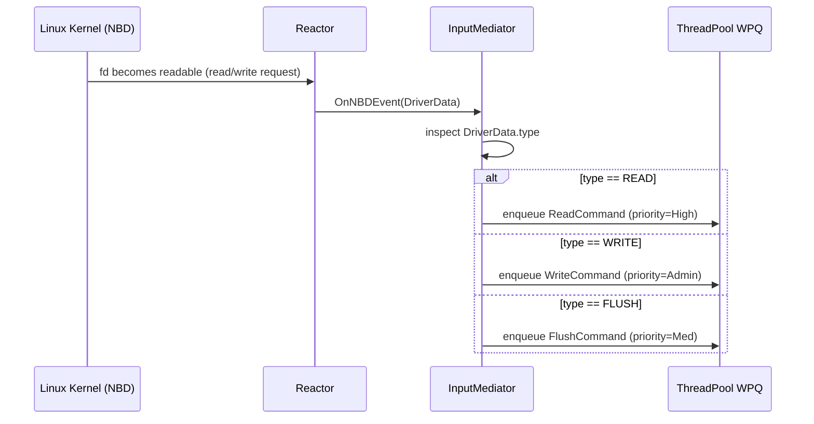

# NBD Layer — Network Block Device

## What is NBD?

NBD (Network Block Device) is a Linux kernel module that exposes a remote storage resource as a local block device (like `/dev/nbd0`). The user can format it, mount it, and use it exactly like a physical disk.

LDS uses NBD as its **entry point** — the kernel sends read/write requests to LDS, which distributes them across the Raspberry Pi minions.

---

## The Core Insight — Why Use a Kernel Protocol At All?

### Without NBD (custom client approach)

You would write your own client tool that users must install and use:

```
user: lds_write("file.txt", data)   ← must use YOUR tool
      ↓
your program → UDP → master → minions
```

Problems:
- User must use your custom tool for **everything**
- `cp`, `vim`, `git`, `python` — none of them work with LDS
- You have to implement folders, permissions, file operations yourself
- Anyone who wants to use LDS must know about your API

### With NBD (kernel protocol approach)

User mounts once:
```bash
mount /dev/nbd0 /mnt/lds
```

Then everything works normally:
```
user: cp file.txt /mnt/lds/    ← normal Linux command, knows nothing about LDS
      ↓
kernel VFS catches it
      ↓
kernel translates to block operations and sends via NBD:
  WRITE at offset 0,    len 4096
  WRITE at offset 4096, len 4096
  FLUSH
      ↓
your NBDDriverComm receives DriverData
      ↓
master distributes to minions
```

The user never thinks about READ/WRITE. The kernel is the translator:

| User does | Kernel generates |
|---|---|
| `cp file.txt /mnt/lds/` | WRITE commands |
| `cat /mnt/lds/file.txt` | READ commands |
| `rm /mnt/lds/file.txt` | WRITE + TRIM commands |
| `sync` | FLUSH command |

### The key point

The kernel already has everything built: file operations, filesystem support, VFS routing, buffering, caching, permissions. By speaking NBD you **plug into all of that for free**.

You're not reimplementing any of it — you just tell the kernel:
> "I'm a block device. Send me the raw I/O and I'll handle the actual storage."

**The kernel is your event catcher. NBD is the plug.**

---

## Why NBD?

| Reason | Detail |
|---|---|
| **Transparent to user** | Looks like a real disk — no special client needed |
| **Kernel-managed I/O** | Caching, buffering handled by VFS |
| **Standard interface** | Works with any filesystem (ext4, xfs, etc.) |
| **Simple protocol** | Just READ / WRITE / FLUSH / TRIM operations |

---

## Alternatives and Why NBD Was Chosen

### FUSE (Filesystem in Userspace)

FUSE lets you implement a **filesystem** in userspace — you handle `open()`, `read()`, `write()`, `readdir()` etc.

| | |
|---|---|
| **Pro** | No root required, easier to develop and debug |
| **Pro** | Works at file level — richer API (filenames, directories) |
| **Con** | Operates at filesystem level, not block level — can't be formatted with arbitrary filesystems |
| **Con** | Higher latency — every syscall crosses kernel↔userspace twice |
| **Con** | Not suitable if you want raw block device semantics |

**Why not for LDS:** LDS needs to expose a raw block device so any filesystem can be placed on top. FUSE would lock you into one filesystem implementation.

---

### iSCSI

iSCSI is a protocol that exposes block storage **over a TCP/IP network**. The kernel has an iSCSI initiator that connects to a remote iSCSI target.

| | |
|---|---|
| **Pro** | Industry standard, widely supported |
| **Pro** | Works over real networks — not limited to one machine |
| **Pro** | Supports enterprise features (multipath, authentication) |
| **Con** | Far more complex protocol — authentication, sessions, LUNs |
| **Con** | Requires a full TCP/IP stack even for local use |
| **Con** | Much harder to implement from scratch |

**Why not for LDS:** iSCSI is the right choice for a production storage product. For a learning project it's overkill — the protocol complexity would overwhelm the actual storage logic you're trying to build. NBD gives you the same block device interface with a fraction of the complexity.

---

### ublk (Userspace Block Device — modern alternative)

`ublk` is a newer Linux kernel feature (kernel 6.0+) that replaces NBD for userspace block device implementations. It uses `io_uring` instead of sockets.

| | |
|---|---|
| **Pro** | Much better performance — `io_uring` avoids context switches |
| **Pro** | More modern, actively developed |
| **Con** | Requires kernel 6.0+ — not available on older systems |
| **Con** | More complex to implement |
| **Con** | Less documentation and examples |

**Why not for LDS:** Requires a very recent kernel. NBD is available on any Linux system and has decades of documentation and examples — better for a learning project.

---

### virtio-blk

virtio-blk exposes a block device to a **virtual machine guest** via the virtio bus.

| | |
|---|---|
| **Pro** | Extremely high performance inside VMs |
| **Con** | Only works inside a VM (QEMU/KVM) — useless on bare metal |

**Why not for LDS:** LDS runs on bare metal (Raspberry Pis). virtio-blk is irrelevant outside a VM context.

---

### Summary — Why NBD for LDS

| | NBD | FUSE | iSCSI | ublk |
|---|---|---|---|---|
| Block device semantics | ✓ | ✗ | ✓ | ✓ |
| Simple protocol | ✓ | ✓ | ✗ | ✓ |
| Available on any Linux | ✓ | ✓ | ✓ | ✗ (kernel 6+) |
| Easy to implement | ✓ | ✓ | ✗ | ✗ |
| Works on bare metal | ✓ | ✓ | ✓ | ✓ |

NBD hits the sweet spot for a learning project: **block device semantics with a simple enough protocol to implement yourself** — exactly what a final project needs.

---

## How It Works

```
User process
  └─→ write("/mnt/lds/file.txt", data)
        └─→ Linux VFS
              └─→ /dev/nbd0   ← block device
                    └─→ NBD kernel driver
                          └─→ LDS Master process (via socket)
                                └─→ Reactor receives fd event
                                      └─→ InputMediator → Commands → Minions
```

---

## Event Flow in LDS



---

## Components

### IDriverComm — The Interface

`IDriverComm` is the abstraction layer between the storage/mediator logic and the communication protocol. Any protocol (NBD, iSCSI, etc.) implements this interface. The mediator only ever holds an `IDriverComm*` — it never mentions `NBDDriverComm` directly.

```cpp
std::unique_ptr<IDriverComm> driver = std::make_unique<NBDDriverComm>("/dev/nbd0", 512 * 1024 * 1024);

while (true) {
    auto request = driver->ReceiveRequest();  // input from kernel
    // storage processes request...
    driver->SendReply(request);               // output back to kernel
}
```

Swapping NBD for iSCSI = change one line (the `make_unique`). Nothing else changes.

---

### DriverData — The Request Object

`DriverData` is a protocol-neutral request container. It lives for the full round-trip of one I/O operation:

1. `ReceiveRequest()` creates it from the raw kernel binary
2. Storage layer processes it — fills `m_buffer` (READ) or reads `m_buffer` (WRITE), sets `m_status`
3. `SendReply()` encodes it back to binary and sends to kernel

**Fields:**
- `m_type` — READ / WRITE / FLUSH / TRIM / DISCONNECT
- `m_offset` — where on the block device
- `m_len` — how many bytes
- `m_buffer` — data (kernel fills for WRITE, storage fills for READ)
- `m_handle` — cookie so kernel can match reply to its original request
- `m_status` — SUCCESS or FAILURE, set by storage before SendReply

---

### NBDDriverComm — The Implementation

#### Socket Setup

```
socketpair() creates:
  sp[0] → serverFd  (kept by us)
  sp[1] → clientFd  (given to kernel via NBD_SET_SOCK)

our code (serverFd)  <------->  kernel NBD driver (clientFd)
```

`socketpair` uses `AF_UNIX` (Unix domain socket) — not UDP, not TCP. It stays entirely in kernel memory, never touches the network. `SOCK_STREAM` means ordered and reliable, like TCP but local-only.

#### Constructor Steps

1. `socketpair()` — create the two connected socket ends
2. `open("/dev/nbdX")` — open the NBD kernel driver fd
3. `NBD_SET_SIZE` — tell kernel the device capacity
4. `NBD_CLEAR_SOCK` — reset any stale state from a previous run
5. `NBD_SET_FLAGS` — enable TRIM and FLUSH support
6. `NBD_SET_SOCK(clientFd)` — hand clientFd to the kernel
7. Spawn `m_listener` thread → calls `NBD_DO_IT` (blocks inside kernel)
8. `SetUpSignals()` — set up clean shutdown on SIGINT/SIGTERM

#### Three Threads

| Thread | Job |
|---|---|
| **main thread** | `ReceiveRequest()` / `SendReply()` loop |
| **m_listener** | Blocked inside `NBD_DO_IT` — keeps the kernel side alive |
| **m_signal_thread** | Waits for SIGINT/SIGTERM → calls `Disconnect()` |

`NBD_DO_IT` runs inside the kernel and blocks forever — it can't be stopped from within the same thread. So it gets its own thread. To stop it, the signal thread calls `NBD_DISCONNECT` from outside, which forces `NBD_DO_IT` to unblock and return.

#### ListenerThread

```
block ALL signals (so only m_signal_thread handles them)
→ NBD_DO_IT  (blocks here — kernel I/O runs)
→ NBD_CLEAR_QUE  (flush pending kernel queue)
→ NBD_CLEAR_SOCK  (detach socket from driver)
```

#### Signal Handling

```cpp
// main thread: block SIGINT/SIGTERM so they don't interrupt mid-operation
pthread_sigmask(SIG_BLOCK, &set, nullptr);

// dedicated thread: wait for the signal, then shut down cleanly
sigwait(&set, &sig);
Disconnect();
```

#### Shutdown Chain

```
SIGINT/SIGTERM arrives
  → m_signal_thread wakes from sigwait
  → calls Disconnect()
  → NBD_DISCONNECT ioctl
  → NBD_DO_IT unblocks and returns
  → m_listener.join() completes
  → fds closed
```

---

### ReceiveRequest — Kernel → DriverData

Translates raw binary NBD request into a clean `DriverData`:

1. `ReadAll(serverFd, &request, sizeof(request))` — read full header (loop handles partial reads)
2. Validate magic number — every valid NBD request starts with `NBD_REQUEST_MAGIC`
3. Decode fields from network byte order (`ntohl`, `be64toh` for 64-bit offset)
4. Map NBD command → `ActionType`
5. Build `DriverData`
6. **WRITE only**: also read the data payload into `m_buffer` right after the header

For READ, `m_buffer` stays empty — storage fills it later.

---

### SendReply — DriverData → Kernel

Translates processed `DriverData` back to binary NBD reply:

1. Build `nbd_reply` header with magic, error code, and handle (same handle from request)
2. `WriteAll(serverFd, &reply, sizeof(reply))` — send header
3. **READ success only**: also send `m_buffer` data after the header

Data direction:
```
WRITE: kernel → [header + data payload] → us       SendReply → [header only]
READ:  kernel → [header only]           → us       SendReply → [header + data]
```

---

### Why ReceiveRequest and SendReply are separate

The mediator/storage layer processes requests in between:

```
ReceiveRequest() → [storage does work] → SendReply()
```

Combining them would require passing a callback or handler in, coupling protocol to processing logic — defeating the purpose of `IDriverComm`.

---

## DriverData as Input to the Mediator

`ReceiveRequest()` is the mediator's input source. The mediator loop:

```cpp
while (true) {
    auto request = driver->ReceiveRequest();  // blocks until kernel sends something
    // dispatch based on request->m_type
    // storage fills m_buffer (READ) or reads m_buffer (WRITE), sets m_status
    driver->SendReply(request);
}
```

`IDriverComm` is the input side of the mediator pattern — the mediator doesn't know or care if requests come from NBD, iSCSI, or anything else.

---

## Related Notes
- [[System Overview]]
- [[InputMediator]]
- [[Reactor]]
- [[Why RAII]]
