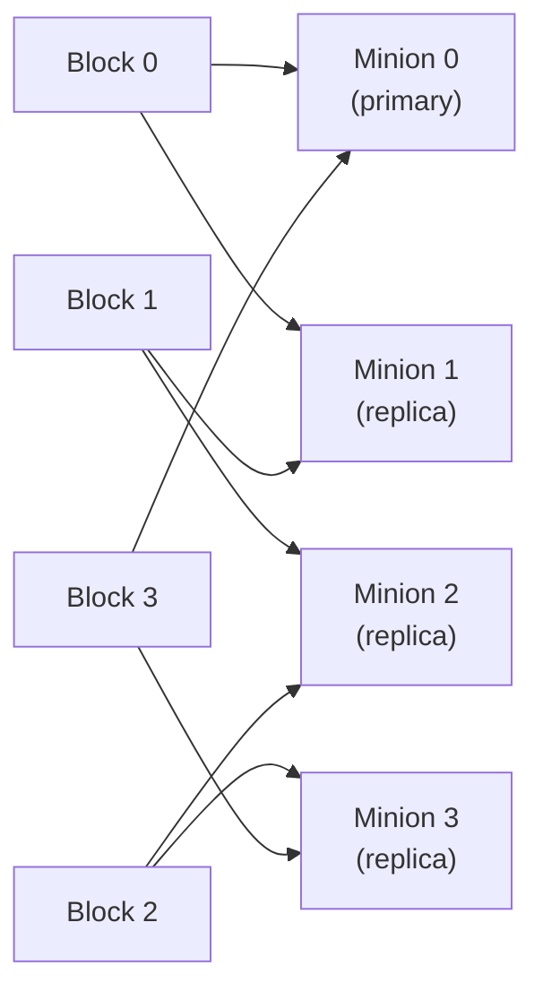
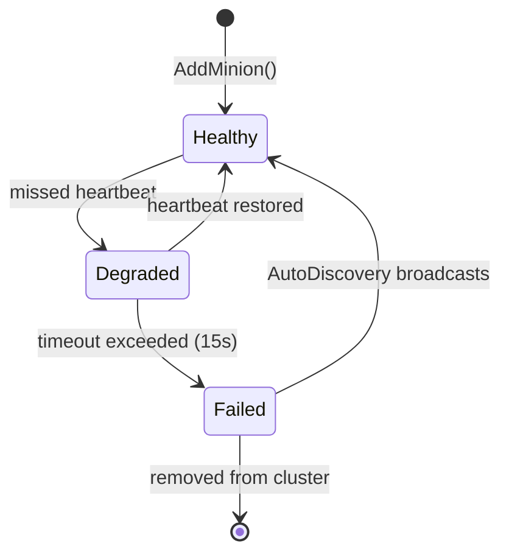
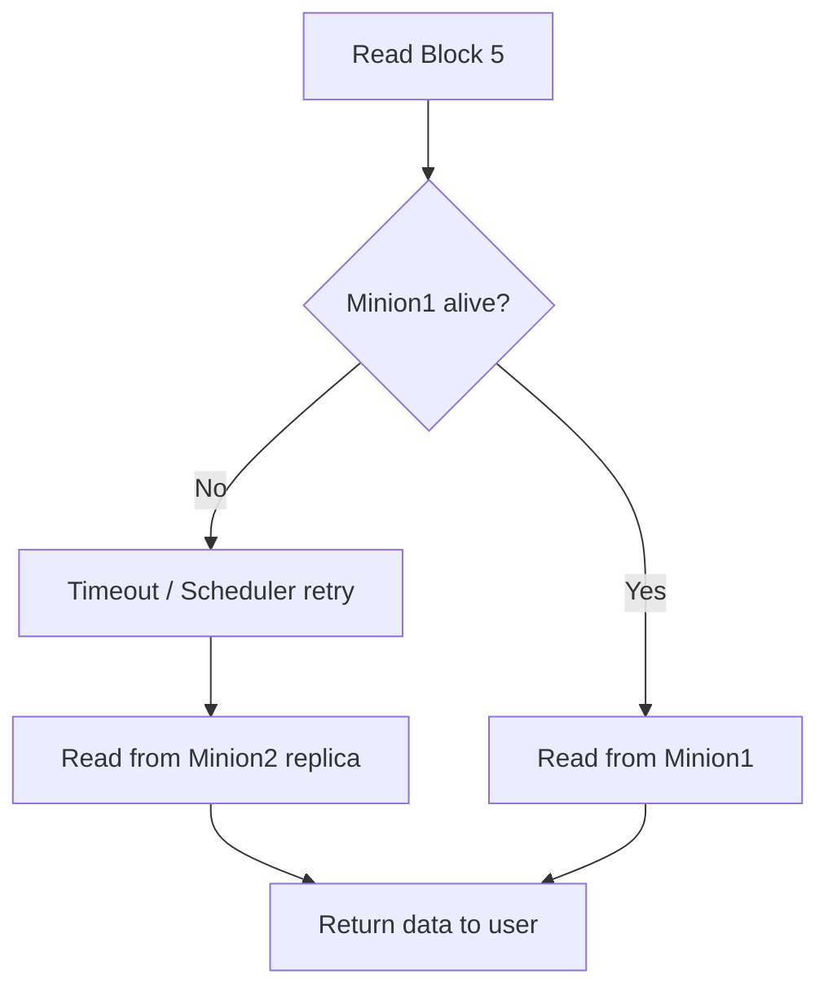

# RAID01 — How It Works in LDS

## What is RAID01?

RAID01 combines mirroring (RAID1) with striping (RAID0):
- **Striping** — data is split into blocks distributed across minions (performance)
- **Mirroring** — each block is stored on exactly **2 minions** (redundancy)

Result: if any single minion dies, all data is still accessible from its replica.

---

## Block Mapping Strategy

```
Total blocks: N
Minion count: M

Block B is stored on:
  Primary   = B % M
  Replica   = (B + 1) % M

Example with 4 minions (M0, M1, M2, M3):
  Block 0  → M0 (primary), M1 (replica)
  Block 1  → M1 (primary), M2 (replica)
  Block 2  → M2 (primary), M3 (replica)
  Block 3  → M3 (primary), M0 (replica)
  Block 4  → M0 (primary), M1 (replica)  ← wraps around
```



---

## RAID01Manager Interface

```cpp
class RAID01Manager {
public:
    // Returns (primary_id, replica_id)
    std::pair<int, int> GetBlockLocation(uint64_t block_num);

    void AddMinion(int id, const std::string& ip, int port);
    void FailMinion(int id);          // marks minion as failed
    void RecoverMinion(int id);       // marks minion healthy again

    void SaveMapping(const std::string& filepath);
    void LoadMapping(const std::string& filepath);

private:
    std::map<int, Minion> minions_;
    std::map<uint64_t, std::pair<int, int>> block_map_;
};
```

---

## Minion Status States



---

## Failure Scenario — Single Minion Down

```
Normal:   Block 5 → Minion1 (primary) ✅, Minion2 (replica) ✅
Failure:  Minion1 goes down
Read:     ReadCommand tries Minion1 → timeout → retries Minion2 ✅
Write:    WriteCommand writes to Minion2 only (single copy, degraded mode)
Recovery: Minion1 rejoins → AutoDiscovery detects it → resync missing blocks
```



---

## Data Structures

```cpp
struct Minion {
    int id;
    std::string ip;
    int port;
    enum Status { HEALTHY, DEGRADED, FAILED } status;
    time_t last_response_time;
};
```

---

## Persistence

The block map is saved to disk so the mapping survives master restarts:
- On startup: `LoadMapping("raid_map.bin")`
- On shutdown / periodic: `SaveMapping("raid_map.bin")`

---

## Related Notes
- [[RAID01 Manager]]
- [[Watchdog]]
- [[AutoDiscovery]]
- [[System Overview]]
