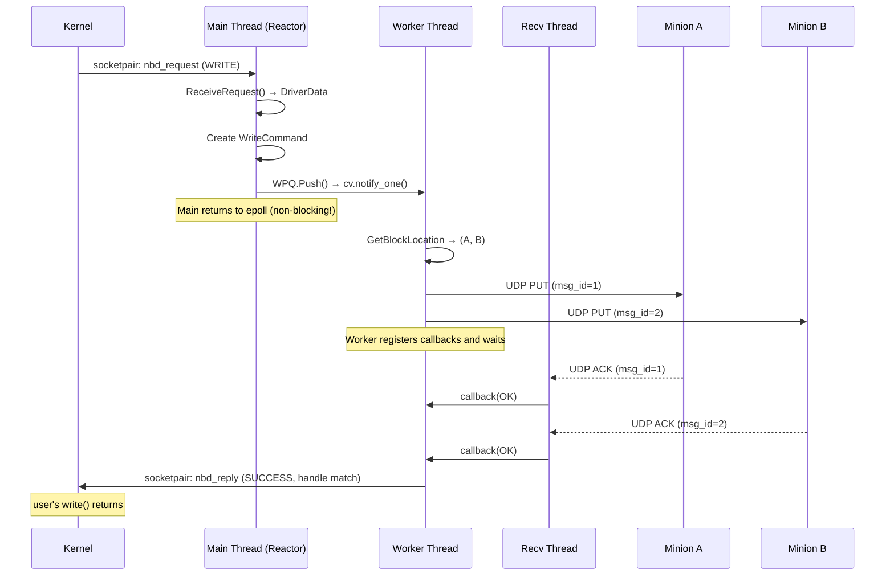

# Request Lifecycle — From Kernel to Minion and Back

This document traces a single write request from the moment the user calls `write()` on a mounted filesystem to the moment the kernel acknowledges the I/O complete. Every component touched, in order.

---

## Phase 1 Lifecycle (Current — LocalStorage)

### Write Request Path

```
Step 1: User process
  write(fd, buf, 512)  ← e.g. writing to a file on /mnt/nbd

Step 2: VFS → Block Layer → NBD Driver (kernel)
  kernel encodes:
    nbd_request { magic, type=WRITE, handle=0xABCD, from=4096, len=512 }
  kernel writes struct to m_clientFd (socketpair)
  kernel BLOCKS — user's write() is suspended until we reply

Step 3: Reactor (main thread)
  epoll_wait() on m_serverFd fires (EPOLLIN)
  io_handler(serverFd) called

Step 4: NBDDriverComm::ReceiveRequest()
  ReadAll(m_serverFd, &req, sizeof(nbd_request))  ← read header
  ReadAll(m_serverFd, buf, req.len)               ← read data (for writes)
  decode → DriverData { WRITE, handle=0xABCD, offset=4096, buffer=512B }
  return shared_ptr<DriverData>

Step 5: app/LDS.cpp handler
  if type == WRITE:
    storage.Write(data)  ← memcpy into m_storage[4096..4607]
  data->m_status = SUCCESS

Step 6: NBDDriverComm::SendReply()
  encode: nbd_reply { magic, error=0, handle=0xABCD }
  WriteAll(m_serverFd, &reply, sizeof(nbd_reply))
  ← write data back for READ requests only

Step 7: Kernel receives reply
  matches handle 0xABCD → this request is done
  unblocks user's write() → returns 512
```

**Total thread count:** 1 (main thread does everything)

---

## Phase 2+ Lifecycle (Target — RAID01 + Minions)

### Write Request Path (Full Distributed)

```
Step 1-4: Same as above → DriverData arrives on main thread

Step 5: InputMediator::HandleEvent(fd)  [main thread]
  data = driver.ReceiveRequest()
  cmd = make_shared<WriteCommand>(data, raid, proxy, response_mgr)
  thread_pool.AddCommand(cmd)       ← non-blocking push to WPQ
  ← main thread returns to epoll immediately

Step 6: ThreadPool worker thread picks up WriteCommand
  cmd = wpq.Pop()     ← wakes from blocking wait
  cmd->Execute()

Step 7: WriteCommand::Execute()  [worker thread]
  block_num = data->m_offset / BLOCK_SIZE
  [minionA, minionB] = raid.GetBlockLocation(block_num)

Step 8: MinionProxy::SendPutBlock(minionA, data) → msg_id_A  [worker]
  serialize: [MSG_ID][OP=PUT][OFFSET][LEN][DATA]
  sendto(udp_fd, packet, minion_A_addr)
  response_mgr.RegisterCallback(msg_id_A, onAckA)
  scheduler.Track(msg_id_A, deadline = now + 1s)

Step 9: MinionProxy::SendPutBlock(minionB, data) → msg_id_B  [worker]
  (same as above for second minion)

Step 10: ResponseManager receiver thread
  recvfrom(udp_fd) → UDP packet from minionA
  parse: [MSG_ID=msg_id_A][STATUS=OK]
  lookup callback for msg_id_A → call onAckA()
  scheduler.OnResponse(msg_id_A)

Step 11: Both ACKs received → WriteCommand completes
  driver.SendReply(data)  ← reply to kernel (finally!)

Step 12: Kernel unblocks user's write()
```

**Total thread count:** 1 (main) + N (workers) + 1 (RecvThread)

---

## Read Request Path (Phase 2+)

```
Steps 1-6: Same as write up to Execute()

Step 7: ReadCommand::Execute()  [worker thread]
  block_num = data->m_offset / BLOCK_SIZE
  [primary, replica] = raid.GetBlockLocation(block_num)

Step 8: Try primary first
  msg_id = proxy.SendGetBlock(primary, offset, length)
  response_mgr.RegisterCallback(msg_id, onData)
  scheduler.Track(msg_id, deadline = now + 1s)

Step 9a: Primary responds (happy path)
  recvfrom → [MSG_ID][STATUS=OK][LEN][DATA]
  callback fires with data
  driver.SendReply(data with buffer filled)

Step 9b: Primary timeout (failure path)
  scheduler detects deadline exceeded after 1s
  retry → SendGetBlock(replica, offset, length)
  if replica also fails after 3 retries:
    data->m_status = FAILURE
    driver.SendReply(data)  ← kernel gets an error → user sees EIO
```

---

## Timing Diagram — Phase 2 Write



**Key insight:** The main thread is non-blocking. It creates the command and returns to epoll immediately. The worker thread does the heavy lifting. The kernel's user process is blocked only until the worker completes, not until the main thread loops around.

---

## What Happens on DISCONNECT

```
Step 1: User unmounts or process exits
Step 2: Kernel sends nbd_request { type=NBD_CMD_DISC }
Step 3: ReceiveRequest() returns DriverData { DISCONNECT }
Step 4: Handler calls reactor.Stop() + driver.Disconnect()
Step 5: ioctl(NBD_DISCONNECT) → wakes ListenerThread's ioctl(NBD_DO_IT)
Step 6: Reactor's Run() loop sees running=false → exits
Step 7: Destructors fire in LIFO order
```

---

## Error Handling — The Missing Reply Bug (Bug #3)

```cpp
// CURRENT (broken):
storage.Read(request);     // if this throws...
driver.SendReply(request); // ...this NEVER runs → kernel hangs forever

// CORRECT:
try {
    storage.Read(request);
} catch (...) {
    request->m_status = DriverData::FAILURE;
    // fall through — always send a reply
}
driver.SendReply(request);  // kernel always gets an answer
```

The kernel's user process will hang forever in `read()` if we don't send a reply. Even if the operation failed, we must send a reply with `error != 0` so the kernel can unblock the user and return `EIO`.

---

## Shared Pointer Lifetime of DriverData

```
created:  ReceiveRequest() → make_shared<DriverData>
                                    ↓
            shared_ptr count = 1 (held by handler)
                                    ↓
         WriteCommand stores shared_ptr → count = 2
                                    ↓
         handler returns → count = 1 (command holds it)
                                    ↓
         command Execute() completes → count = 0 → destroyed

No copies of the buffer data.
The same DriverData (with its m_buffer) travels from ReceiveRequest
all the way to SendReply — zero copies.
```

This is intentional. `shared_ptr<DriverData>` threads through the system as a zero-copy handle. The data buffer is allocated once in `ReceiveRequest()` and freed automatically when all holders release it.

---

## Related Notes
- [[Concurrency Model]]
- [[System Overview]]
- [[NBD Protocol Deep Dive]]
- [[InputMediator]]
- [[Sequence - Write Request]]
