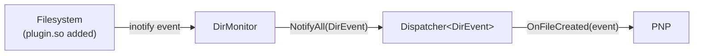

# DirMonitor

**Phase:** 1 (complete) | **Status:** ✅ Implemented

**Files:**
- `utils/Inotify_cpp/` (inotify wrapper)

---

## Responsibility

DirMonitor watches a directory using Linux `inotify` and notifies observers (via Dispatcher) whenever a file is created or deleted. In LDS this is used to detect when a new plugin `.so` is dropped into the plugin directory.

---

## Interface

```cpp
class DirMonitor {
public:
    explicit DirMonitor(Dispatcher<DirEvent>& dispatcher);
    void Watch(const std::string& path);
    void Run();   // blocks, processing inotify events

private:
    int inotify_fd_;
    Dispatcher<DirEvent>& dispatcher_;
};

struct DirEvent {
    std::string filename;
    std::string action;   // "CREATE" or "DELETE"
};
```

---

## Flow



---

## Why inotify?

| Alternative | Problem |
|---|---|
| Polling (stat every second) | Wastes CPU, slow detection |
| FAM/Gamin | Deprecated |
| inotify | Linux native, kernel-level, instant, zero polling |

---

## Related Notes
- [[Observer]]
- [[PNP]]
