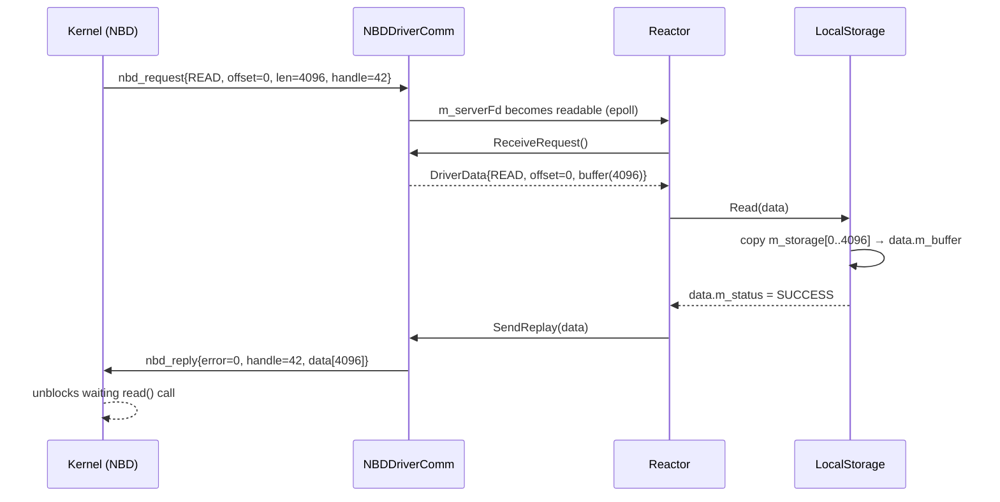

# NBDDriverComm

**Phase:** 1 (complete) | **Status:** ✅ Implemented

**Files:**
- `services/communication_protocols/nbd/include/NBDDriverComm.hpp`
- `services/communication_protocols/nbd/src/NBDDriverComm.cpp`
- `services/communication_protocols/nbd/include/DriverData.hpp`

---

## Responsibility

`NBDDriverComm` is the **kernel-to-userspace bridge**. It speaks the binary NBD protocol, translating raw kernel `nbd_request` packets into `DriverData` objects and back. Everything above it (Reactor, LocalStorage) deals only with `DriverData` — they never touch binary NBD format.

---

## The Socket Architecture

```
Linux Kernel (NBD module)
    │ writes nbd_request structs
    │
    ▼ m_clientFd
[  socketpair (AF_UNIX, SOCK_STREAM)  ]
    ▼ m_serverFd
    │ reads by ReceiveRequest()
    │ writes by SendReplay()
    ▼
NBDDriverComm (userspace)
```

Why `socketpair` instead of pipe:
- NBD kernel driver requires a **socket** FD for `ioctl(NBD_SET_SOCK)`
- Pipes are not sockets — can't use them
- `socketpair` is bidirectional (single pair vs two one-way pipes)
- `AF_UNIX` avoids the TCP/IP stack entirely — local only

---

## Threads Inside NBDDriverComm

Two background threads are started in the constructor:

### 1. Listener Thread (`m_listener`)
```cpp
void ListenerThread() {
    sigfillset(&mask);
    pthread_sigmask(SIG_BLOCK, &mask, nullptr);  // block ALL signals
    ioctl(m_nbdFd, NBD_DO_IT);                   // blocks forever
}
```

- **Purpose:** Tells kernel to start forwarding block I/O over the socket
- `ioctl(NBD_DO_IT)` is a **blocking kernel call** — never returns until disconnect
- Cannot run on main thread (would freeze the program)
- Must block ALL signals — any signal interrupts `ioctl` with `EINTR`, which kills the kernel relay

### 2. Signal Thread (`m_signal_thread`)
```cpp
void SignalThread() {
    sigwait(&signals, &sig);   // wait for SIGINT or SIGTERM
    Disconnect();               // clean shutdown
}
```

- Handles `SIGINT`/`SIGTERM` for graceful shutdown
- ⚠️ **Bug:** can deadlock if it calls `Disconnect()` which joins itself

---

## NBD Wire Protocol

```
Kernel → Userspace (nbd_request):
  [magic    : 4 bytes]  = 0x25609513 (validation)
  [type     : 4 bytes]  = READ / WRITE / DISC / FLUSH / TRIM
  [handle   : 8 bytes]  = opaque ID — must echo back in reply
  [from     : 8 bytes]  = byte offset
  [len      : 4 bytes]  = byte count
  [data     : len bytes] (only for WRITE)

Userspace → Kernel (nbd_reply):
  [magic    : 4 bytes]  = 0x67446698
  [error    : 4 bytes]  = 0 (success) or errno
  [handle   : 8 bytes]  = copied from request unchanged
  [data     : len bytes] (only for READ response)
```

`m_handle` is opaque — never interpret it, just echo it back. The kernel uses it to route the reply to the correct blocked process.

---

## DriverData — The Request Object

```cpp
struct DriverData {
    enum Type { READ, WRITE, FLUSH, TRIM, DISCONNECT };
    enum Status { SUCCESS, FAILURE };

    Type                 m_type;
    uint64_t             m_offset;
    std::vector<char>    m_buffer;   // data (filled by kernel for WRITE, by storage for READ)
    Status               m_status;
    // m_handle stored internally — not exposed
};
```

Lifecycle:
1. `ReceiveRequest()` creates it from raw binary
2. `LocalStorage::Read/Write` fills `m_buffer` (READ) or reads `m_buffer` (WRITE), sets `m_status`
3. `SendReplay()` encodes it back to binary and sends to kernel

---

## Sequence: Full Read Request



---

## IDriverComm — The Abstraction

`NBDDriverComm` implements `IDriverComm`:

```cpp
class IDriverComm {
public:
    virtual std::shared_ptr<DriverData> ReceiveRequest() = 0;
    virtual void SendReply(std::shared_ptr<DriverData>) = 0;
    virtual int  GetFD() const = 0;
    virtual ~IDriverComm() = default;
};
```

This means the Reactor and LocalStorage never mention `NBDDriverComm` directly — they hold `IDriverComm*`. Swapping NBD for iSCSI = one line change.

---

## Known Bugs

| Bug | Description |
|---|---|
| Race in Disconnect() | `m_nbdFd` is a plain int; signal thread + destructor can double-close |
| Signal thread self-join | `Disconnect()` → destructor → `join()` on the thread currently executing |
| Constructor thread leak | Thread started before `ioctl` setup; if `ioctl` throws, thread is never joined |
| Signal conflict | Reactor's `signalfd` + NBDDriverComm's `sigwait` both handle SIGINT |

Full details: [[Known Bugs]]

---

## Related Notes
- [[NBD Layer]]
- [[Reactor]]
- [[LocalStorage]]
- [[Known Bugs]]
