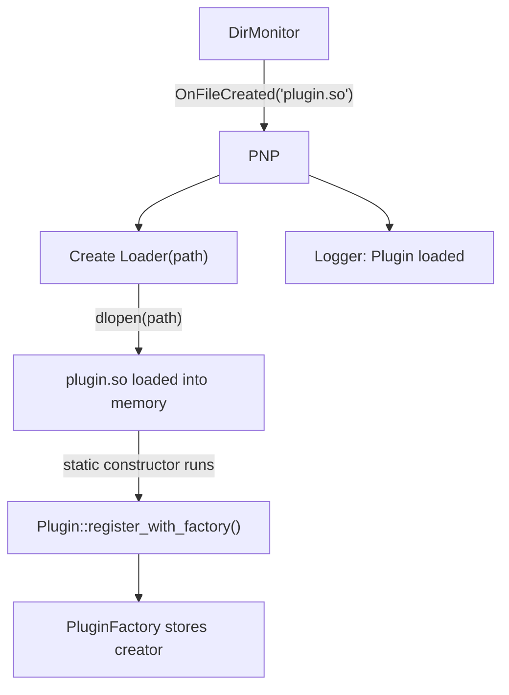

# PNP (Plug & Play)

**Phase:** 1 (complete) | **Status:** ✅ Implemented

---

## Responsibility

PNP is the **plugin orchestrator**. It subscribes to DirMonitor events. When a `.so` file appears, PNP creates a Loader to `dlopen` it. The plugin's static constructor runs automatically, registering itself with the PluginFactory. PNP also handles unloading when a `.so` is deleted.

---

## Flow



---

## Interface

```cpp
class PNP {
public:
    PNP(Dispatcher<DirEvent>& dispatcher,
        PluginFactory& factory);

    void OnFileCreated(const DirEvent& event);   // called by CallBack
    void OnFileDeleted(const DirEvent& event);

private:
    std::unordered_map<std::string, std::unique_ptr<Loader>> loaded_plugins_;
    PluginFactory& factory_;
};
```

---

## RAII Plugin Lifecycle

PNP stores Loader instances in a map. When a `.so` is deleted:
- PNP removes the Loader from the map
- Loader destructor calls `dlclose()`
- Plugin is unloaded from memory automatically

---

## Related Notes
- [[Observer]]
- [[Factory]]
- [[Singleton]]
- [[DirMonitor]]
