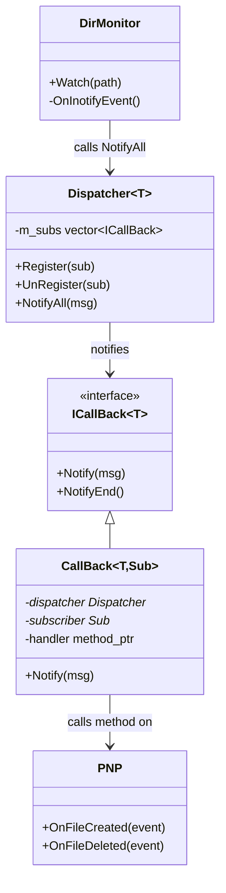

# Observer Pattern

## Purpose

Notify **multiple listeners** when an event occurs, without the publisher knowing who's listening.

Mental model: a **magazine subscription list** — when a new issue is published, every subscriber gets it automatically. The publisher doesn't know or care who subscribed.

---

## Status in Project

✅ **Already implemented** — `design_patterns/observer/`

Used by: **DirMonitor → PNP** (filesystem events), future: health events, minion state changes

---

## Three Components

| Role | Class | Does What |
|---|---|---|
| **Subject** | `Dispatcher<T>` | Holds observer list, calls `NotifyAll()` |
| **Observer interface** | `ICallBack<T>` | Contract: implement `Notify(msg)` |
| **Concrete observer** | `CallBack<T, Sub>` | Bridges Dispatcher → subscriber method |

---

## Interface

```cpp
// design_patterns/observer/include/ICallBack.hpp
template <typename Msg>
class ICallBack {
public:
    virtual void Notify(const Msg& msg) = 0;
    virtual void NotifyEnd() = 0;
    virtual ~ICallBack() = default;
};

// design_patterns/observer/include/Dispatcher.hpp
template <typename Msg>
class Dispatcher {
public:
    void Register(ICallBack<Msg>* sub);
    void UnRegister(ICallBack<Msg>* sub);
    void NotifyAll(const Msg& msg);   // broadcasts to all registered

private:
    std::vector<ICallBack<Msg>*> m_subs;
};
```

---

## How to Use — 4 Steps

### Step 1: Define event type

```cpp
struct FileEvent {
    std::string filename;
    std::string action;   // "CREATE", "DELETE"
};
```

### Step 2: Create dispatcher

```cpp
Dispatcher<FileEvent> dispatcher;
```

### Step 3: Create subscriber

```cpp
class PNP {
public:
    void OnFileCreated(const FileEvent& event) {
        // load the plugin at event.filename
    }
};
```

### Step 4: Wire together with CallBack (auto-registers via constructor)

```cpp
PNP pnp;
CallBack<FileEvent, PNP> observer(
    &dispatcher,
    &pnp,
    &PNP::OnFileCreated
);
// observer automatically registers on construction
// and unregisters on destruction (RAII)

// Publish an event:
dispatcher.NotifyAll(FileEvent{"plugin.so", "CREATE"});
// → PNP::OnFileCreated called automatically
```

---

## Class Diagram



---

## RAII Registration

`CallBack` registers in its constructor and unregisters in its destructor — no manual cleanup needed:

```cpp
{
    CallBack<FileEvent, PNP> obs(&dispatcher, &pnp, &PNP::OnFileCreated);
    // obs is registered
    dispatcher.NotifyAll(event);  // PNP notified
}
// obs destructor → automatically unregisters
```

---

## Why Observer (not direct calls)?

```
Direct call (tight coupling):
    DirMonitor::onEvent() {
        pnp.LoadPlugin(...);    // DirMonitor must know about PNP
        logger.Log(...);        // DirMonitor must know about Logger
    }
    // Adding a new listener = modifying DirMonitor

Observer (loose coupling):
    DirMonitor::onEvent() {
        dispatcher.NotifyAll(event);  // DirMonitor knows nothing
    }
    // Adding a new listener = just register a new CallBack
```

See [[Why Observer Pattern]] for full reasoning.

---

## Template Type Safety

The template parameter `T` ensures you can't accidentally send a `NetworkEvent` to a `FileEvent` dispatcher:

```cpp
Dispatcher<FileEvent> file_dispatcher;
Dispatcher<NetworkEvent> net_dispatcher;

// Compile error — wrong event type:
// file_dispatcher.NotifyAll(NetworkEvent{});  ❌
```

---

## Related Notes
- [[DirMonitor]]
- [[PNP]]
- [[Why Observer Pattern]]
- [[Why Templates not Virtual Functions]]

---

## Detailed Implementation Reference

*Source: `design_patterns/observer/README.md`*

### Pattern Overview

**Purpose**: Establish a one-to-many dependency where when one object changes state, all its dependents are notified automatically.

**Problem It Solves**:
- How to decouple event producers from event consumers?
- How to allow multiple observers to react to the same event?
- How to avoid tight coupling between components?

### Implementation Structure

```
design_patterns/observer/
├─ include/
│  ├─ Dispatcher.hpp     # Event broadcaster
│  ├─ ICallBack.hpp      # Observer interface
│  └─ CallBack.hpp       # Concrete observer
```

### Used In Local Cloud

**DirMonitor → Dispatcher → PNP**

```cpp
// DirMonitor uses Dispatcher to notify PNP
Dispatcher<DirEvent> dispatcher;
CallBack<DirEvent, PNP> pnp_observer(&dispatcher, &pnp, &PNP::onDirChange);

// File appears
dispatcher.NotifyAll(DirEvent{FILE_CREATED, "plugin.so"});
// PNP::onDirChange() is called automatically
```

### Common Pitfalls

```cpp
// Bad: Observer not unregistered (leaked, keeps receiving events)
new CallBack<Event, Logger>(&dispatcher, &logger, &Logger::onEvent);

// Good: RAII - unregisters automatically when goes out of scope
CallBack<Event, Logger> observer(&dispatcher, &logger, &Logger::onEvent);
```

### Threading

- RAII for thread-safe registration/unregistration
- `NotifyAll` is NOT thread-safe during iteration — copy observer list before notifying in multi-threaded contexts

### Related Patterns

- **Observer + Factory**: Factory creates plugins → Plugin subscribes to events → Dispatcher notifies plugin
- **Observer + Command**: Event received → Create Command → Execute in ThreadPool

**Status**: ✅ Fully implemented and tested | **Used By**: DirMonitor, PNP, all event-driven components
