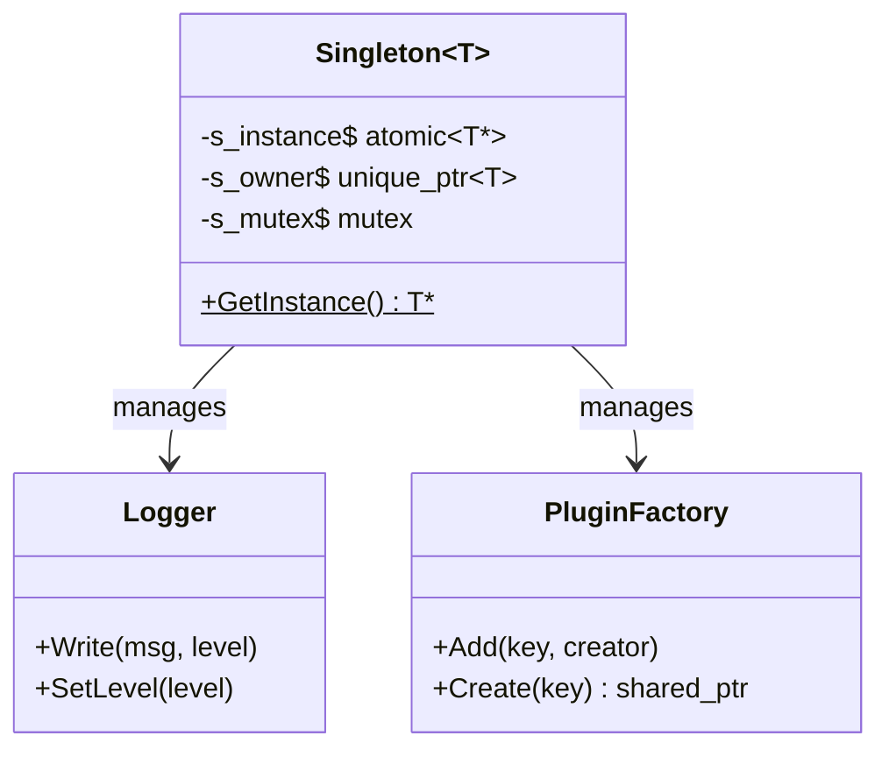

# Singleton Pattern

## Purpose

Ensure exactly **one global instance** of a class exists, accessible from anywhere.

Mental model: a company has **one CEO** — you always reach the same person through the same channel, no matter who's calling.

---

## Status in Project

✅ **Already implemented** — `design_patterns/singleton/include/singelton.hpp`

Used by: **Logger**, **PluginFactory**

---

## Interface

```cpp
// design_patterns/singleton/include/singelton.hpp

template <typename T>
class Singleton {
public:
    static T* GetInstance();   // creates on first call, returns same after

private:
    static std::atomic<T*>   s_instance;
    static std::unique_ptr<T> s_owner;   // RAII cleanup
    static std::mutex         s_mutex;   // thread safety
};
```

---

## How to Use

```cpp
// Get the one instance — same object every call
Logger* log = Singleton<Logger>::GetInstance();
log->Write("Plugin loaded", Logger::INFO);

// Somewhere else in the codebase:
Logger* log2 = Singleton<Logger>::GetInstance();
assert(log == log2);  // ✅ always true
```

---

## Class Diagram



---

## Thread Safety

The implementation uses double-checked locking with `std::atomic`:

```cpp
T* Singleton<T>::GetInstance() {
    T* ptr = s_instance.load(std::memory_order_acquire);
    if (!ptr) {
        std::lock_guard<std::mutex> lock(s_mutex);
        ptr = s_instance.load(std::memory_order_relaxed);
        if (!ptr) {
            s_owner = std::make_unique<T>();
            ptr = s_owner.get();
            s_instance.store(ptr, std::memory_order_release);
        }
    }
    return ptr;
}
```

---

## When to Use Singleton

| Use ✅ | Avoid ❌ |
|---|---|
| Logger | User sessions |
| Plugin registry | Request handlers |
| Config manager | Regular objects |
| Service registry | Anything needing multiple instances |

---

## Mental Model

```
Any code anywhere:
  └─→ Singleton<Logger>::GetInstance()
        └─→ same Logger instance always
              (lazy created on first call)
```

---

## Related Notes
- [[Factory]]
- [[Logger]]

---

## Detailed Implementation Reference

*Source: `design_patterns/singleton/README.md`*

### Pattern Overview

**Purpose**: Ensure a class has only one instance and provide a global point of access to it.

**Problem It Solves**:
- How to ensure only one instance of a class exists?
- How to provide global access without global variables?
- How to lazy-initialize expensive resources?
- How to manage shared state safely?

### Singleton in Local Cloud Phases

| Component | Purpose | Phase |
|-----------|---------|-------|
| Logger | Global logging | 1 ✅ |
| PluginFactory | Plugin registry | 1 ✅ |
| ServiceRegistry | Service discovery | 2 🔄 |
| ConfigManager | Shared configuration | 2 🔄 |
| MessageBroker | RPC communication | 3 📋 |
| ResourceScheduler | Resource quotas | 4 📋 |
| AuthManager | Service authentication | 6 📋 |

### Testing with Singletons

The main challenge is hidden dependencies. Best approach: inject the singleton so tests can use mocks.

```cpp
// Production: Use singletons
Logger& logger = Logger::getInstance();
OrderProcessor processor(logger, db);

// Testing: Use mocks
MockLogger mock_logger;
OrderProcessor processor(mock_logger, mock_db);
```

### Anti-Patterns to Avoid

- Don't use Singleton as a global variable replacement (hides dependencies)
- Don't overuse — only for shared resources (Logger, ConfigManager, ServiceRegistry)
- Don't use for stateful objects with mutable state

**Status**: ✅ Fully implemented and tested | **Used By**: Logger, PluginFactory, ServiceRegistry
