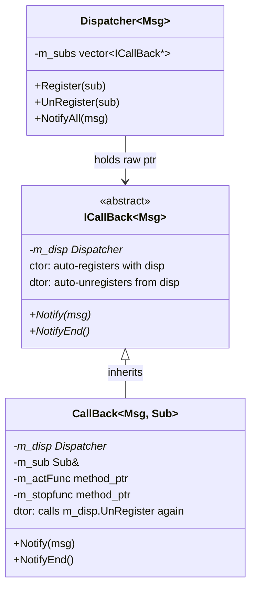

# Observer Pattern Internals — ICallBack / CallBack / Dispatcher

Three classes work together to implement the Observer pattern. This document covers how they interact at the code level, the RAII auto-registration trick, and the template mechanics.

---

## The Three Players

```
Dispatcher<Msg>            — the subject (event source)
ICallBack<Msg>             — abstract observer interface + RAII registration
CallBack<Msg, Sub>         — concrete observer, binds a subscriber + method
```



---

## ICallBack — RAII Auto-Registration

```cpp
// ICallBack.hpp
template <typename Msg>
ICallBack<Msg>::ICallBack(Dispatcher<Msg>* disp_)
    : m_disp(disp_)
{
    if (m_disp) {
        m_disp->Register(this);   // ← auto-register on construction
    }
}

template <typename Msg>
ICallBack<Msg>::~ICallBack()
{
    if (m_disp) {
        m_disp->UnRegister(this); // ← auto-unregister on destruction
        m_disp = nullptr;
    }
}
```

**What this means:** Any class inheriting from `ICallBack` is automatically registered with the Dispatcher the moment it's constructed, and automatically removed when destroyed. No manual `Register`/`UnRegister` calls in user code.

This is RAII applied to event subscriptions — the subscription lifetime is tied to the object lifetime.

---

## CallBack — Binding a Method to a Subscriber

```cpp
// CallBack.hpp
template <typename Msg, typename Sub>
class CallBack : public ICallBack<Msg>
{
public:
    using ActionFunc = void (Sub::*)(const Msg&);  // member function pointer
    using StopFunc   = void (Sub::*)();

    explicit CallBack(Dispatcher<Msg>* disp, Sub& sub,
                      ActionFunc actFunc, StopFunc stopFunc = nullptr);
    ~CallBack();

    void Notify(const Msg& msg) override;
    void NotifyEnd() override;

private:
    Dispatcher<Msg>* m_disp;   // Note: ICallBack ALSO stores m_disp → Bug #11
    Sub&             m_sub;
    ActionFunc       m_actFunc;
    StopFunc         m_stopfunc;
};
```

**Constructor — three things happen:**
1. `ICallBack<Msg>(disp_)` constructor runs → registers `this` with Dispatcher
2. Stores reference to subscriber object
3. Stores member function pointer

**`Notify` — how member function pointer dispatch works:**
```cpp
void CallBack<Msg, Sub>::Notify(const Msg& msg_) {
    (m_sub.*m_actFunc)(msg_);
    //  ↑ dereference ref  ↑ call through member fn ptr
}
```

`m_sub.*m_actFunc` is the C++ syntax for calling a member function through a pointer. It calls `m_actFunc` on the object `m_sub`.

---

## Usage Example — Connecting DirMonitor to SoLoader

```cpp
// In PNP or main setup:
Dispatcher<const std::string&> fileDispatcher;

DirMonitor monitor("/plugins", fileDispatcher);  // fires events via dispatcher
SoLoader loader(&fileDispatcher);                 // subscribes to events

// Inside SoLoader constructor:
m_pluginCB = new CallBack<const std::string&, SoLoader>(
    &fileDispatcher,       // dispatcher to register with
    *this,                  // subscriber object
    &SoLoader::OnLoad       // method to call on event
);
```

When `DirMonitor` detects a new `.so` file:
1. `fileDispatcher.NotifyAll(filepath)`
2. Dispatcher iterates `m_subs`
3. `loader.m_pluginCB->Notify(filepath)`
4. `(loader.*&SoLoader::OnLoad)(filepath)`
5. `SoLoader::OnLoad` calls `dlopen`

---

## The Type Safety Advantage

Compare with a dynamic (virtual) approach:

```cpp
// Dynamic (runtime type-unsafe):
class IObserver {
    virtual void onEvent(void* data) = 0;  // must cast void* → any type
};

// Template (compile-time type-safe):
class CallBack<std::string, SoLoader> {
    void Notify(const std::string& msg);   // compiler verifies type at registration
};
```

With templates, if you accidentally pass a `CallBack<int, Foo>` to a `Dispatcher<std::string>`, you get a **compile error** instead of a runtime crash. The message type is enforced by the type system.

---

## Bug #11 — Double UnRegister

```cpp
// ICallBack destructor:
~ICallBack() {
    m_disp->UnRegister(this);   // UnRegister #1
    m_disp = nullptr;
}

// CallBack destructor:
~CallBack() {
    m_disp->UnRegister(this);   // UnRegister #2 — calls on ICallBack's m_disp
}
```

`CallBack` stores `m_disp` separately from `ICallBack::m_disp` (which is `private`). Both destructors run (C++ calls base dtor after derived dtor). Result: `UnRegister` is called twice.

**Is it harmful?** `UnRegister` uses `std::remove` which is a no-op if the element isn't found. So it's functionally correct, just wasteful.

**Fix:** Make `ICallBack::m_disp` protected so `CallBack` can access and null it out.

---

## Bug #8 — Dispatcher Not Thread-Safe

```cpp
template <typename Msg>
class Dispatcher {
    std::vector<ICallBack<Msg>*> m_subs;  // no mutex

    void Register(ICallBack<Msg>* sub) {
        m_subs.push_back(sub);             // modifies vector
    }

    void NotifyAll(const Msg& msg) {
        for (auto* sub : m_subs) {        // reads vector
            sub->Notify(msg);
        }
    }
};
```

**Scenario:** Thread 1 calls `NotifyAll()` (iterating `m_subs`). Thread 2 calls `Register()` (calling `push_back`). If `push_back` triggers a reallocation, Thread 1's iterator points to freed memory → use-after-free → crash.

**Fix:**
```cpp
mutable std::shared_mutex m_mutex;

void Register(ICallBack<Msg>* sub) {
    std::unique_lock lock(m_mutex);  // exclusive write
    m_subs.push_back(sub);
}

void NotifyAll(const Msg& msg) {
    std::shared_lock lock(m_mutex);  // shared read (multiple readers OK)
    for (auto* sub : m_subs) {
        sub->Notify(msg);
    }
}
```

---

## `NotifyEnd` — Dispatcher Shutdown

When the Dispatcher is destroyed, it calls `NotifyEnd()` on all remaining subscribers:

```cpp
Dispatcher<Msg>::~Dispatcher() {
    for (ICallBack<Msg>* sub : m_subs) {
        if (sub) {
            sub->NotifyEnd();  // tells subscriber: no more events coming
        }
    }
}
```

This is used when a subscriber needs to clean up state (e.g., close a file, stop a thread) when its event source disappears. The optional `StopFunc` in `CallBack` is called here.

---

## Memory Layout — Who Owns What

```
┌──────────────────────┐
│  Dispatcher          │
│  m_subs: [ptr, ptr]  │ ← raw pointers, does NOT own
└──────────────────────┘
         ↓
┌──────────────────────┐
│  CallBack (on heap)  │ ← OWNED by whoever created it (SoLoader, etc.)
│  ICallBack part      │
│    m_disp → disp     │
│  m_sub → SoLoader    │
│  m_actFunc → OnLoad  │
└──────────────────────┘
```

Dispatcher stores raw pointers to `ICallBack` objects. The objects are owned externally (usually by the subscriber itself). When the subscriber is destroyed, `ICallBack::~ICallBack()` runs and removes the raw pointer from Dispatcher's list.

**Critical:** The subscriber must outlive the Dispatcher, OR unregister before it's destroyed. If Dispatcher is destroyed first, it calls `NotifyEnd()` on dangling pointers → crash.

---

## Related Notes
- [[Observer]]
- [[DirMonitor]]
- [[PNP]]
- [[Known Bugs]]
