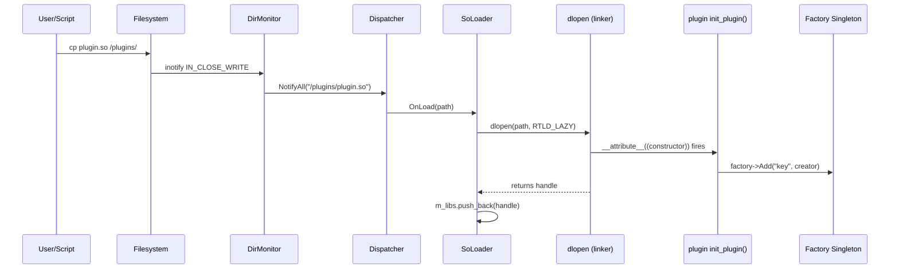

# Plugin Loading Internals — dlopen, inotify, constructor attributes

The plugin system is one of the most Linux-specific parts of LDS. It lets you drop a `.so` file into a directory and have it automatically loaded and registered — zero restarts, zero recompilation.

---

## The Complete Pipeline

```
1. User copies plugin.so → /plugins/
2. Linux kernel fires IN_CLOSE_WRITE event
3. DirMonitor reads from inotify fd → path string
4. DirMonitor calls: dispatcher.NotifyAll("/plugins/plugin.so")
5. SoLoader::OnLoad receives the path
6. dlopen("plugin.so", RTLD_LAZY) → loads the .so into process memory
7. __attribute__((constructor)) fires automatically
8. Plugin registers itself in the global Factory singleton
9. Any future Create("key") call uses the new plugin
```

---

## Layer 1: inotify — Kernel Filesystem Events

```cpp
// Inside DirMonitor
int inotify_fd = inotify_init();                          // create inotify instance
inotify_add_watch(inotify_fd, "/plugins", IN_CLOSE_WRITE); // watch for writes

// In the event loop (runs in background thread):
char buf[4096];
read(inotify_fd, buf, sizeof(buf));  // blocks until event
inotify_event* event = (inotify_event*)buf;
// event->name = "plugin.so"
dispatcher.NotifyAll("/plugins/" + event->name);
```

**Why `IN_CLOSE_WRITE` not `IN_CREATE`?**

| Event | When it fires | File state |
|---|---|---|
| `IN_CREATE` | When the file is first created | Empty / partially written |
| `IN_CLOSE_WRITE` | After the last writer closes the fd | Fully written, safe to `dlopen` |

If we used `IN_CREATE`, we'd try to `dlopen` an empty or partially-written file. `dlopen` would fail (corrupt ELF header). `IN_CLOSE_WRITE` guarantees the file is complete.

---

## Layer 2: SoLoader — dlopen

```cpp
// soLoader.cpp
void SoLoader::OnLoad(const std::string& libPath) {
    void* handle = dlopen(libPath.c_str(), RTLD_LAZY);

    if (!handle) {
        throw std::runtime_error(std::string("dlopen failed: ") + dlerror());
    }

    m_libs.push_back(handle);  // store handle for dlclose later
}
```

**`RTLD_LAZY`** — defers symbol resolution until the symbol is first called. Faster load time vs `RTLD_NOW` (resolve everything immediately). For our case, `RTLD_LAZY` is fine because the constructor attribute runs at load time and registers via the Factory.

**`RTLD_DEEPBIND`** — (optional, not used here) makes the `.so` resolve its own symbols before checking the host process. Prevents symbol name conflicts between plugins and the host.

**`dlerror()`** — must be called immediately after `dlopen` failure. The error string is not thread-safe and may be overwritten by the next `dlerror()` call.

---

## Layer 3: `__attribute__((constructor))` — Auto Self-Registration

```cpp
// sample_plugin.cpp
__attribute__((constructor))
void init_plugin() {
    // This runs AUTOMATICALLY when dlopen() is called
    // before dlopen() returns

    auto factory = Singleton<PluginFactory>::GetInstance();
    factory->Add("main", [](std::nullptr_t) {
        return std::make_shared<std::function<void()>>(&SamplePlugin::main);
    });
}

__attribute__((destructor))
void cleanup_plugin() {
    // This runs AUTOMATICALLY when dlclose() is called
    // Can be used to deregister from Factory (not implemented yet)
}
```

**Execution order:**
1. `dlopen("plugin.so")` called
2. Dynamic linker loads the `.so` into memory
3. All `__attribute__((constructor))` functions run (in order of `.init_array` section)
4. `dlopen()` returns the handle
5. Plugin is now registered and usable

**Why this is elegant:** The plugin registers itself. The host process never needs to know the plugin name, type, or registration key. The Factory becomes a self-populating registry.

---

## Layer 4: Factory — Runtime Object Creation

```cpp
// factory.hpp
template <typename Base, typename Key, typename Args>
class Factory {
    std::unordered_map<Key, CreateFunc> m_createTable;

public:
    void Add(const Key& key, CreateFunc fn) {
        m_createTable[key] = fn;
    }

    std::shared_ptr<Base> Create(const Key& key, Args& args) {
        return m_createTable.at(key)(args);  // throws if key not found
    }
};
```

After plugin load: `factory->Create("main", args)` calls the lambda that was registered in `init_plugin()`.

**Factory is a Singleton** — `friend Singleton<Factory<...>>` in the template makes the ctor private, forcing access via `Singleton<Factory>::GetInstance()`. This ensures all plugins register in the same global table.

---

## SoLoader Lifetime and dlclose

```cpp
SoLoader::~SoLoader() {
    for (void* lib : m_libs) {
        dlclose(lib);  // decrements reference count
    }
    delete m_pluginCB;  // unregisters from Dispatcher
}
```

**`dlclose` reference counting:** `dlopen` on the same path increments a counter; `dlclose` decrements it. The library is only unmapped when the counter reaches 0. This allows multiple clients to open the same `.so`.

**Critical Bug (#3 in codebase):** `dlclose` must only be called after all code executing from that library has returned. If a plugin callback is still on the call stack when `dlclose` runs, the code is unmapped from under it → segfault.

Current implementation is safe because SoLoader controls both the load and the lifecycle via RAII.

---

## Full Sequence Diagram



---

## Why Not Use a Config File?

Alternative: maintain a `plugins.conf` file that lists which `.so` files to load.

| Approach | Advantage | Disadvantage |
|---|---|---|
| Config file | Explicit, auditable | Requires restart or separate watcher; config can get out of sync |
| inotify auto-load | Zero configuration, live reload | Slightly less auditable; malicious .so = instant code execution |

For a NAS system, live reload without restarts is a key feature. The tradeoff is acceptable.

---

## Security Consideration

`dlopen` on an untrusted `.so` is **arbitrary code execution**. The plugin directory must have restricted write permissions (`chmod 700`, root-owned). In production this would require:
- Plugin signing (verify SHA256 signature before dlopen)
- Plugin directory owned by root, writable only by root
- Dropped privileges before entering the Reactor loop

---

## Related Notes
- [[DirMonitor]]
- [[PNP]]
- [[Factory]]
- [[Observer Pattern Internals]]
- [[Why IN_CLOSE_WRITE not IN_CREATE]]
