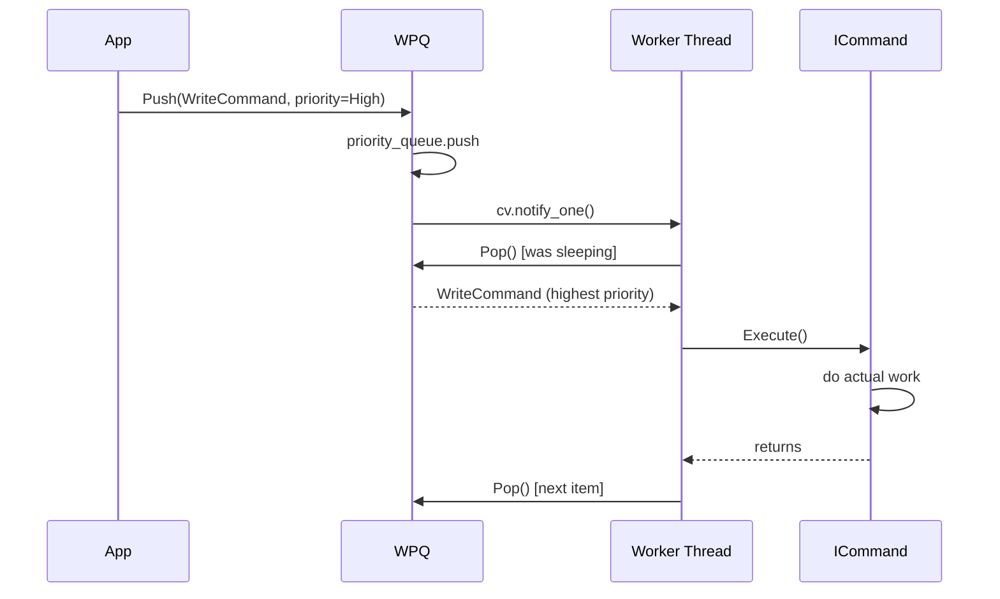

# Threading Deep Dive — WPQ + ThreadPool Internals

## Overview

The threading system has three layers:
```
ThreadPool  →  manages N worker threads
WPQ         →  thread-safe priority queue (the work buffer)
ICommand    →  unit of work with priority
```

---

## WPQ — Weighted Priority Queue

### How it works

```cpp
template <typename T>
class WPQ {
    std::priority_queue<T, std::vector<T>, std::less<T>> m_pq;
    std::mutex              m_mutex;
    std::condition_variable m_cv;
public:
    void Push(T item) {
        std::lock_guard lock(m_mutex);
        m_pq.push(std::move(item));
        m_cv.notify_one();        // wake one sleeping worker
    }

    T Pop() {
        std::unique_lock lock(m_mutex);
        m_cv.wait(lock, [this]{ return !m_pq.empty(); });
        // ↑ atomically: release mutex + sleep until predicate true
        T item = std::move(m_pq.top());
        m_pq.pop();
        return item;
    }
};
```

### Why condition_variable (not busy-wait)?

```
Busy-wait (BAD):
  while (queue.empty()) {}  // burns 100% CPU doing nothing

Condition variable (GOOD):
  cv.wait(lock, pred)       // thread is SUSPENDED by OS, uses 0% CPU
                            // wakes only when push() notifies
```

### Spurious Wakeup Protection

The predicate form `cv.wait(lock, pred)` is equivalent to:
```cpp
while (!pred()) {
    cv.wait(lock);
}
```
This re-checks the condition after every wakeup. Without it, a spurious wakeup (OS can wake a thread for no reason) would cause Pop() to return with an empty queue.

---

## ThreadPool Internals

### Worker Loop

```cpp
// Each worker thread runs this:
void worker_loop() {
    while (true) {
        try {
            auto cmd = wpq.Pop();    // blocks until work available
            cmd->Execute();          // run the command
        }
        catch (StopException&) {
            break;                   // graceful shutdown signal
        }
        catch (...) {
            // ← BUG: exception swallowed silently
            // user command threw, we'll never know
        }
    }
}
```

---

## Graceful Shutdown

```cpp
void ThreadPool::Stop() {
    Resume();              // wake any suspended threads first (bug fix)
    for (int i = 0; i < num_threads; ++i) {
        wpq.Push(StopCommand{});   // one StopCommand per thread
    }
    for (auto& t : workers) {
        t.join();          // wait for each thread to finish
    }
}
```

**Why exactly N StopCommands?**
- Each worker pops ONE StopCommand and exits
- N workers → N commands → all exit cleanly
- Too few: some workers never see a stop → hang on join()
- Too many: extras sit in queue after all threads exit (harmless)

**Why Low priority?**
- Workers finish ALL pending user commands first
- Then pick up the StopCommand and exit
- This is graceful shutdown — no work is dropped

---

## Suspend / Resume

```cpp
// SuspendCommand::Execute():
void Execute() override {
    std::unique_lock lock(m_mutex);
    m_cv.wait(lock, [this]{ return !m_suspend_flag; });
    // thread blocks here until Resume() is called
}

// ThreadPool::Resume():
void Resume() {
    m_suspend_flag = false;
    m_cv.notify_all();    // wake ALL suspended workers
}
```

**Why High priority?**
- Must jump to front of queue immediately
- Low priority = workers finish everything else before suspending
- High priority = workers preempt queue and suspend immediately

---

## Priority Levels

| Priority | Value | Used For |
|---|---|---|
| `Admin` | 3 | System commands (suspend, flush) |
| `High` | 2 | Write operations (data critical) |
| `Med` | 1 | Read operations |
| `Low` | 0 | Background tasks, **Stop** |

The WPQ's `priority_queue` uses `operator<` on ICommand — higher priority number = dequeued first.

---

## The Static Bug (Critical)

```cpp
class ThreadPool {
    static std::mutex              m_mutex;  // ← STATIC
    static std::condition_variable m_cv;     // ← STATIC
};
```

This means ALL ThreadPool instances share the same mutex and cv:

```cpp
ThreadPool tp1(4);
ThreadPool tp2(4);

tp2.Resume();      // calls m_cv.notify_all()
                   // wakes ALL 8 workers (tp1's + tp2's)
                   // tp1's workers exit suspension unexpectedly
```

**Fix:** make these instance members (remove `static`).

---

## StopException — Why Anonymous Namespace?

```cpp
// Inside thread_pool.cpp only:
namespace {
    class StopException {};
}
```

`namespace {}` = internal linkage = invisible outside this translation unit.

- User code cannot `catch (StopException&)` — they don't know it exists
- User code cannot `throw StopException{}` — can't inject false stop signals
- Only the ThreadPool implementation can use it

This is intentional encapsulation — the shutdown mechanism is implementation-private.

---

## Sequence: Command Lifecycle



---

## Related Notes
- [[Command]]
- [[Known Bugs]]
- [[System Overview]]
