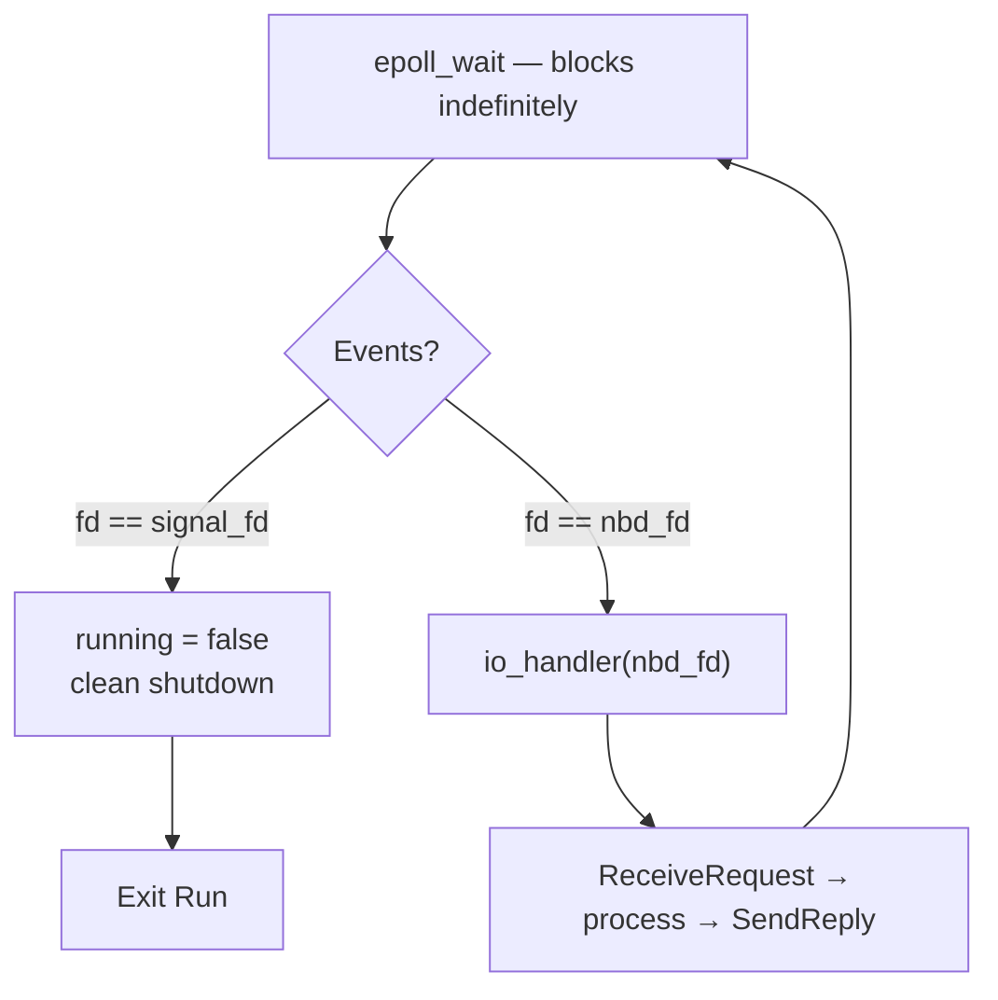
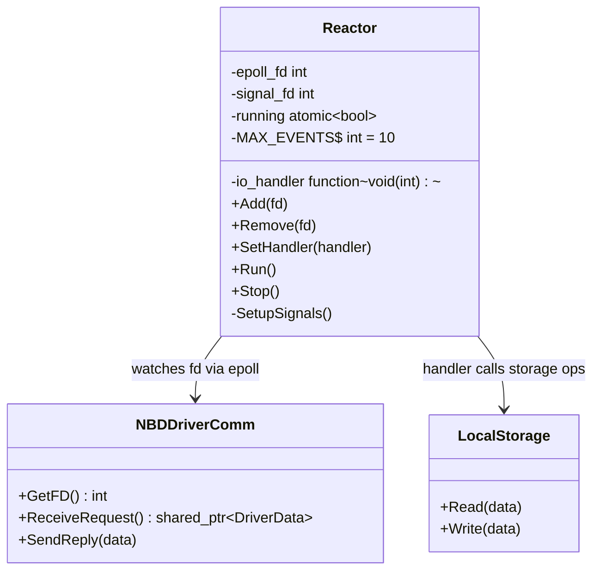

# Reactor Pattern

## Purpose

The Reactor is the **event loop** of the entire LDS master. It uses Linux `epoll` to monitor multiple file descriptors simultaneously without blocking. When a descriptor becomes ready (e.g. an NBD request arrives), the Reactor dispatches it to the registered handler.

Mental model: a **traffic control tower** — monitors all runways at once, routes each incoming flight to the right gate, never leaves the tower.

---

## Status in Project

✅ **Already implemented** — in `design_patterns/reactor/`

---

## Actual Interface (from `reactor.hpp`)

```cpp
namespace hrd41 {

class Reactor {
public:
    explicit Reactor();
    ~Reactor();

    Reactor(const Reactor&) = delete;
    Reactor& operator=(const Reactor&) = delete;

    void Add(int fd);                           // register fd with epoll
    void Remove(int fd);                        // deregister fd
    void SetHandler(std::function<void(int)>);  // single handler for ALL fds
    void Run();                                 // blocking event loop
    void Stop();                                // stop the loop

private:
    int epoll_fd;                   // epoll instance (epoll_create1)
    int signal_fd;                  // signalfd for SIGINT/SIGTERM
    std::atomic<bool> running;
    std::function<void(int)> io_handler;
    static constexpr int MAX_EVENTS = 10;

    void SetupSignals();
};

} // namespace hrd41
```

**Key design choice:** One shared handler for ALL fds — not a per-fd handler map. The handler receives the `fd` that fired and decides what to do with it.

---

## How epoll Works

```
epoll_create1(0)   → create the interest set
epoll_ctl(ADD, fd) → register a file descriptor
epoll_wait()       → block until any fd is ready (returns N events)
  └─→ for each event: if fd == signal_fd → stop; else → io_handler(fd)
```



---

## Signal Handling — signalfd

The Reactor uses `signalfd` instead of `sigaction` or `signal()`. This is the modern Linux approach.

```cpp
void Reactor::SetupSignals() {
    sigset_t mask;
    sigemptyset(&mask);
    sigaddset(&mask, SIGINT);
    sigaddset(&mask, SIGTERM);

    sigprocmask(SIG_BLOCK, &mask, nullptr); // block signals from async delivery

    signal_fd = signalfd(-1, &mask, SFD_CLOEXEC); // deliver them as fd events
    epoll_ctl(epoll_fd, EPOLL_CTL_ADD, signal_fd, &event); // watch in epoll
}
```

**Why `signalfd` over `sigaction`?**

| | `sigaction` | `signalfd` |
|---|---|---|
| When does handler run? | Async interrupt (anytime) | Only when fd is readable in epoll |
| Thread safety | Restricted API (async-signal-safe only) | Full C++ allowed |
| Works with epoll | ❌ | ✅ |
| Code complexity | High (careful async-safe coding) | Low (just read from fd) |

---

## How It's Wired in `app/LDS.cpp`

```cpp
int main() {
    NBDDriverComm driver("/dev/nbd0", size);
    LocalStorage storage(size);
    Reactor reactor;

    reactor.Add(driver.GetFD());   // watch the NBD server socket
    reactor.SetHandler([&](int fd) {
        // called whenever an NBD request arrives
        auto request = driver.ReceiveRequest();

        if (request->m_type == DriverData::DISCONNECT) {
            reactor.Stop();
            return;
        }

        if (request->m_type == DriverData::READ) {
            storage.Read(request);
        } else {
            storage.Write(request);
        }
        driver.SendReply(request);
    });

    reactor.Run();  // blocks here until SIGINT/SIGTERM
}
```

---

## Run() — The Event Loop

```cpp
void Reactor::Run() {
    running = true;

    while (running) {
        epoll_event events[MAX_EVENTS];
        int n = epoll_wait(epoll_fd, events, MAX_EVENTS, -1);  // -1 = wait forever

        if (n == -1) {
            if (errno == EINTR) continue;  // interrupted by signal, retry
            throw ReactorError("epoll_wait failed");
        }

        for (int i = 0; i < n; ++i) {
            if (events[i].data.fd == signal_fd) {
                running = false;   // SIGINT/SIGTERM received → stop
            } else {
                io_handler(events[i].data.fd);   // dispatch to handler
            }
        }
    }
}
```

**`-1` timeout** = block indefinitely (0 = poll, positive = timeout in ms).

**`EPOLLIN` (level-triggered, default)** — epoll keeps notifying as long as data is available, not just on state change. Simpler than edge-triggered (`EPOLLET`); correct for this use case.

**`EINTR` retry** — a signal may interrupt `epoll_wait` before any fd is ready. This is not an error; just loop.

---

## Class Diagram (Actual Architecture)



---

## Why One Handler for All FDs?

In Phase 1, there is only one interesting fd: the NBD server socket. The single-handler design is simpler.

In future phases, the handler would dispatch based on `fd`:

```cpp
reactor.SetHandler([&](int fd) {
    if (fd == nbd_fd) {
        handleNBDRequest();
    } else if (fd == udp_fd) {
        handleUDPResponse();
    }
    // ...
});
```

This is equivalent to the `std::unordered_map<int, handler>` approach, but without the dispatch overhead.

---

## Why NOT poll/select?

| | `select` | `poll` | `epoll` |
|---|---|---|---|
| Scales to 10k+ fds | ❌ O(n) | ❌ O(n) | ✅ O(1) |
| Returns which fd fired | ❌ (scan all) | ❌ (scan all) | ✅ directly |
| Edge-triggered mode | ❌ | ❌ | ✅ |
| Max fds | 1024 (FD_SETSIZE) | No limit | No limit |
| `signalfd` integration | No | No | ✅ |

---

## Related Notes
- [[NBD Layer]]
- [[Concurrency Model]]
- [[InputMediator]]
- [[NBD Protocol Deep Dive]]
- [[Why signalfd not sigaction]]

---

→ [[04 - Reactor — Component]] — component-level detail (methods, state, invariants)
→ [[03 - Reactor — The Machine]] — runtime execution: how epoll dispatches handlers
