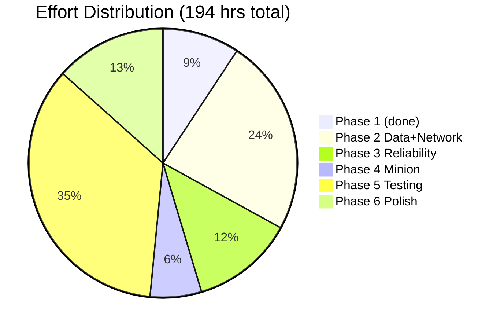

# Timeline & Milestones

## Overall Schedule

| Phase | Start | End | Weeks | Hours | Status |
|---|---|---|---|---|---|
| Phase 1 — Plugin + NBD | 2026-04-01 | 2026-04-18 | 2 | 18+ | ✅ Complete |
| Phase 2 — Data & Network | 2026-05-01 | 2026-05-28 | 4 | 46 | ⏳ Not started |
| Phase 3 — Reliability | 2026-06-01 | 2026-06-21 | 3 | 24 | ⏳ |
| Phase 4 — Minion Server | 2026-06-22 | 2026-07-05 | 2 | 12 | ⏳ |
| Phase 5 — Integration | 2026-07-06 | 2026-07-26 | 3 | 68 | ⏳ |
| Phase 6 — Polish | 2026-07-27 | 2026-08-09 | 2 | 26 | ⏳ |
| **Total** | | | **~16 weeks** | **194 hrs** | |

**Target completion:** August 2026

---

## Milestone Tracker

| Milestone | Target | Status | Description |
|---|---|---|---|
| M0 — Foundation | 2026-04-18 | ✅ Done | Plugin system, NBD, all Phase 1 components |
| M1 — Components Wire Together | End Phase 1 | ⏳ | InputMediator + Commands + ThreadPool flowing |
| M2 — Network Communication | End Phase 2 | ⏳ | Master ↔ Minion UDP working, async responses |
| M3 — Fault Tolerance | End Phase 3 | ⏳ | RAID01 working, failure detection + auto-discovery |
| M4 — Full System Working | End Phase 5 | ⏳ | All components integrated, tests passing |
| M5 — Production Ready | End Phase 6 | ⏳ | Optimized, documented, CI/CD pipeline |

---

## Completed Milestones Log

| Date | Event |
|---|---|
| 2026-04-18 | Phase 1 implementation complete |
| 2026-04-25 | Documentation complete (15+ READMEs, Project Book) |
| 2026-04-25 | Project planning documents created |
| 2026-04-30 | Obsidian vault created with full architecture coverage |
| 2026-05-01 | Docker setup created |

---

## Effort Breakdown by Phase



Phase 5 (68 hrs) is the largest because testing a distributed system is expensive. Budget accordingly.

---

## Weekly Pace

```
Target: ~5 hours/day, 5 days/week = 25 hrs/week
Phase 2: 46 hrs ÷ 25 = ~2 weeks
Phase 5: 68 hrs ÷ 25 = ~3 weeks (more than planned — add buffer)
```

---

## Task Dependencies (Must-Do-First)

```
Cannot start Phase 2 until: Phase 1 complete ✅
Cannot start Phase 3 until: RAID01Manager + MinionProxy (Phase 2)
Cannot start Phase 4 until: Phase 3 design agreed
Cannot start Phase 5 until: Phase 4 complete
Cannot start Phase 6 until: Phase 5 green
```

---

## Related Notes
- [[Risk Register]]
- [[Project Status & Metrics]]
- [[00 Dashboard]]
