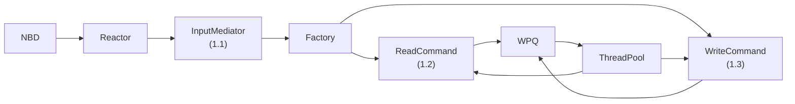

 # Phase 1 — Core Framework Integration

**Duration:** Week 1-2 | **Effort:** 18 hours | **Status:** ⏳ Not Started

---

## Goal

Wire the existing components (Reactor, ThreadPool, Factory) together so that NBD events flow end-to-end through the system, and basic READ/WRITE commands execute (even with mocked storage).

**Milestone:** InputMediator receives NBD events → commands queue in WPQ → commands execute via ThreadPool.

---

## Tasks

### Task 1.1 — InputMediator (4 hrs)
**Files:**
- `services/mediator/include/InputMediator.hpp`
- `services/mediator/src/InputMediator.cpp`

**What to build:**
```
Reactor calls InputMediator::HandleEvent(fd)
  └─→ Read DriverData from NBD fd
        └─→ Inspect type (READ / WRITE / FLUSH)
              └─→ Factory::Create(type, data) → ICommand
                    └─→ ThreadPool::Enqueue(command)
```

**Class stub:**
```cpp
class InputMediator : public IEventHandler {
public:
    explicit InputMediator(ThreadPool& pool);
    void HandleEvent(int fd) override;   // called by Reactor

private:
    ThreadPool& pool_;
    Factory<ICommand, std::string, DriverData>& factory_;
};
```

**Tests to write:**
- [ ] Mock NBD READ event → ReadCommand created and enqueued
- [ ] Mock NBD WRITE event → WriteCommand created and enqueued
- [ ] Priority order preserved in WPQ

**Success:**
- [ ] Reactor calls InputMediator on each NBD event
- [ ] Commands queue with correct priority
- [ ] Unit tests pass

---

### Task 1.2 — ReadCommand (6 hrs)
**Files:**
- `services/commands/include/ReadCommand.hpp`
- `services/commands/src/ReadCommand.cpp`

**What to build:**
```
Execute():
  1. GetBlockLocation(block_num) → (primaryMinion, replicaMinion)
  2. SendGetBlock(primary, offset, length) → MSG_ID
  3. ResponseManager waits for response
  4. On timeout: retry with replicaMinion
  5. On success: nbd_reply(handle, data)
```

**Dependencies:** RAID01Manager (2.1), MinionProxy (2.2) — use mocks for now

**Tests to write:**
- [ ] Reads from primary minion successfully
- [ ] Falls back to replica on primary timeout
- [ ] Returns correct data to NBD

---

### Task 1.3 — WriteCommand (6 hrs)
**Files:**
- `services/commands/include/WriteCommand.hpp`
- `services/commands/src/WriteCommand.cpp`

**What to build:**
```
Execute():
  1. GetBlockLocation(block_num) → (primaryMinion, replicaMinion)
  2. SendPutBlock(primary, data) → MSG_ID_A
  3. SendPutBlock(replica, data) → MSG_ID_B
  4. Wait for at least 1 ACK
  5. nbd_reply(handle, SUCCESS)
```

**Tests to write:**
- [ ] Data written to 2 minions
- [ ] Succeeds if only 1 minion ACKs (degraded mode)
- [ ] Fails only if both minions fail

---

### Task 1.4 — Register Commands with Factory (2 hrs)

```cpp
// In main app initialization
auto& factory = *Singleton<CommandFactory>::GetInstance();
factory.Add("READ",  [](DriverData d) { return std::make_shared<ReadCommand>(d, ...); });
factory.Add("WRITE", [](DriverData d) { return std::make_shared<WriteCommand>(d, ...); });
factory.Add("FLUSH", [](DriverData d) { return std::make_shared<FlushCommand>(d, ...); });
```

**Tests:**
- [ ] Factory creates ReadCommand when asked
- [ ] Factory creates WriteCommand when asked

---

## Component Wiring Diagram



---

## Design Patterns Used

| Pattern | Where |
|---|---|
| [[Reactor\]] | Drives the event loop, calls InputMediator |
| [[Factory\]] | Creates ReadCommand / WriteCommand by type string |
| [[Command\]] | ReadCommand / WriteCommand as ICommand subclasses |
| [[Singleton\]] | Accesses Factory and Logger globally |

---

## Files to Create

```
services/
├── mediator/
│   ├── include/InputMediator.hpp
│   └── src/InputMediator.cpp
└── commands/
    ├── include/ReadCommand.hpp
    ├── include/WriteCommand.hpp
    ├── include/FlushCommand.hpp
    ├── src/ReadCommand.cpp
    ├── src/WriteCommand.cpp
    └── src/FlushCommand.cpp

test/unit/
├── test_input_mediator.cpp
├── test_read_command.cpp
└── test_write_command.cpp
```

---

## Dependencies

- ✅ Reactor — already built
- ✅ ThreadPool + WPQ — already built
- ✅ ICommand base class — already built
- ✅ Factory — already built
- ⚠️ RAID01Manager — use mock/stub (build in Phase 2)
- ⚠️ MinionProxy — use mock/stub (build in Phase 2)

---

## Next Phase

[[Phase 2 - Data Management & Network]]
