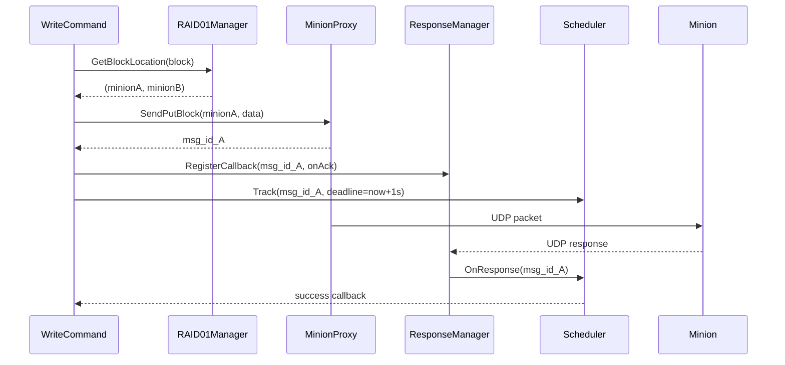

# Phase 2 — Data Management & Network

**Duration:** Week 2-3 | **Effort:** 46 hours | **Status:** ⏳ Not Started

---

## Goal

Implement the real storage and network layers. After this phase, the master can actually talk to minions over UDP, distribute blocks across them, and handle async responses with retry logic.

**Milestone:** Master ↔ Minion communication working end-to-end. Async response handling + retry on timeout.

---

## Tasks

### Task 2.1 — RAID01 Manager (12 hrs)
**Files:**
- `services/storage/include/RAID01Manager.hpp`
- `services/storage/src/RAID01Manager.cpp`

**What to build:**
```
1. Minion registry (id, ip, port, status)
2. Block-to-minion mapping:
   primary = block_num % num_minions
   replica = (block_num + 1) % num_minions
3. FailMinion(id) → reroute to healthy replica
4. Persistence: SaveMapping / LoadMapping
```

**Key data structures:**
```cpp
struct Minion {
    int id;
    std::string ip;
    int port;
    enum Status { HEALTHY, DEGRADED, FAILED } status;
    time_t last_response_time;
};

class RAID01Manager {
public:
    std::pair<int,int> GetBlockLocation(uint64_t block_num);
    void AddMinion(int id, const std::string& ip, int port);
    void FailMinion(int id);
    void SaveMapping(const std::string& path);
    void LoadMapping(const std::string& path);
private:
    std::map<int, Minion> minions_;
};
```

**Tests:**
- [ ] Block mapping correct for 3/4/5 minions
- [ ] FailMinion marks minion failed
- [ ] GetBlockLocation skips failed minions
- [ ] SaveMapping + LoadMapping round-trips correctly

---

### Task 2.2 — MinionProxy (14 hrs)
**Files:**
- `services/network/include/MinionProxy.hpp`
- `services/network/src/MinionProxy.cpp`

**What to build:**
```
1. UDP socket per minion
2. Message serialization:
   [MSG_ID(4B)][OP_TYPE(1B)][OFFSET(8B)][LENGTH(4B)][DATA(var)]
3. SendGetBlock(minion_id, offset, length) → MSG_ID
4. SendPutBlock(minion_id, offset, data)   → MSG_ID
5. Fire-and-forget: ResponseManager handles replies
```

**Message format:**
```
Master → Minion:
  [MSG_ID : 4 bytes]
  [OP_TYPE: 1 byte]   (0=GET, 1=PUT, 2=DELETE)
  [OFFSET : 8 bytes]
  [LENGTH : 4 bytes]
  [DATA   : LENGTH bytes]

Minion → Master:
  [MSG_ID : 4 bytes]
  [STATUS : 1 byte]   (0=OK, 1=ERROR)
  [LENGTH : 4 bytes]
  [DATA   : LENGTH bytes]
```

**Tests:**
- [ ] Message serialized correctly (byte-by-byte check)
- [ ] SendGetBlock returns unique MSG_ID each call
- [ ] UDP packet sent to correct minion IP:port
- [ ] Fake minion receives and parses correctly

---

### Task 2.3 — ResponseManager (10 hrs)
**Files:**
- `services/network/include/ResponseManager.hpp`
- `services/network/src/ResponseManager.cpp`

**What to build:**
```
1. Background UDP receiver thread
2. RegisterCallback(MSG_ID, callback_fn)
3. When response arrives:
   - Parse MSG_ID
   - Lookup callback
   - Call callback(status, data)
4. Thread-safe callback map
```

**Interface:**
```cpp
class ResponseManager {
public:
    void Start(int listen_port);
    void Stop();
    void RegisterCallback(uint32_t msg_id,
                          std::function<void(Status, Buffer)> cb);
private:
    void RecvLoop();   // runs in background thread
    std::unordered_map<uint32_t, Callback> pending_;
    std::mutex mutex_;
};
```

**Tests:**
- [ ] Callback called when response arrives
- [ ] Thread-safe: multiple concurrent callbacks
- [ ] Unknown MSG_ID ignored gracefully

---

### Task 2.4 — Scheduler (10 hrs)
**Files:**
- `services/execution/include/Scheduler.hpp`
- `services/execution/src/Scheduler.cpp`

**What to build:**
```
1. Track pending requests (MSG_ID → deadline)
2. OnResponse(MSG_ID) → mark complete
3. Poll loop: check for expired deadlines
4. Exponential backoff retry:
   1s → 2s → 4s → give up after 3 retries
```

**Retry logic:**
```
Attempt 1: timeout after 1s → retry
Attempt 2: timeout after 2s → retry
Attempt 3: timeout after 4s → give up → error
```

**Tests:**
- [ ] Successful response clears pending entry
- [ ] Timeout triggers retry
- [ ] Exponential delays correct
- [ ] Gives up after max retries

---

## Component Interaction



---

## Design Patterns Used

| Pattern | Where |
|---|---|
| [[Command\|Command]] | ReadCommand/WriteCommand use these components |
| [[Singleton\|Singleton]] | RAID01Manager as global registry |
| [[Observer\|Observer]] | ResponseManager callbacks notify commands |

---

## Files to Create

```
services/
├── storage/
│   ├── include/RAID01Manager.hpp
│   └── src/RAID01Manager.cpp
├── network/
│   ├── include/MinionProxy.hpp
│   ├── include/ResponseManager.hpp
│   ├── src/MinionProxy.cpp
│   └── src/ResponseManager.cpp
└── execution/
    ├── include/Scheduler.hpp
    └── src/Scheduler.cpp
```

---

## Previous / Next

← [[Phase 1 - Core Framework Integration]]
→ [[Phase 3 - Reliability Features]]
