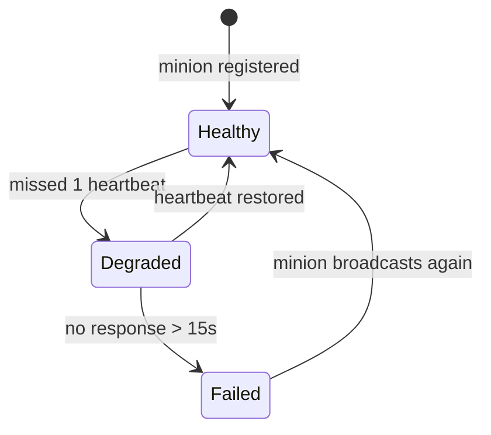
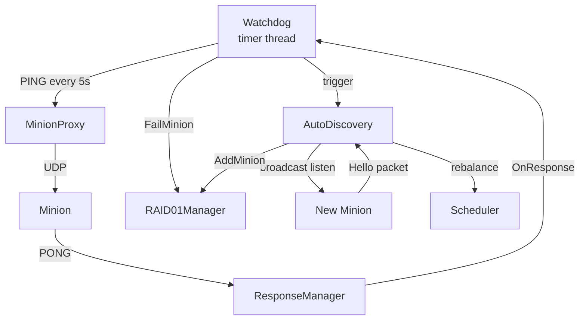

# Phase 3 — Reliability Features

**Duration:** Week 3-4 | **Effort:** 24 hours | **Status:** ⏳ Not Started

---

## Goal

Make the system self-healing. Minions can fail and recover transparently. New minions can join at any time and data rebalances automatically.

**Milestone:** Kill a minion → system detects it → reroutes reads to replica → minion rejoins → auto-discovered → data resyncs.

---

## Tasks

### Task 3.1 — Watchdog (8 hrs)
**Files:**
- `services/health/include/Watchdog.hpp`
- `services/health/src/Watchdog.cpp`

**What to build:**
```
1. Background thread: every 5 seconds PING all minions
2. Track last_response_time per minion
3. If no response for 15 seconds → FailMinion(id)
   → Notify RAID01Manager
   → Trigger AutoDiscovery scan
4. If failed minion responds again → RecoverMinion(id)
```

**State transitions:**


**Ping protocol:**
```
Master → Minion: [MSG_TYPE=PING][timestamp]
Minion → Master: [MSG_TYPE=PONG][timestamp]
```

**Tests:**
- [ ] Minion marked DEGRADED after 1 missed ping
- [ ] Minion marked FAILED after 15s silence
- [ ] RAID01Manager notified on failure
- [ ] Recovery detected when PONG resumes

---

### Task 3.2 — AutoDiscovery (10 hrs)
**Files:**
- `services/discovery/include/AutoDiscovery.hpp`
- `services/discovery/src/AutoDiscovery.cpp`

**What to build:**
```
1. Listen on UDP broadcast port (e.g. 8888)
2. Parse "Hello" packet: "I am Minion-42, Port 9000"
3. New minion:
   - Register with RAID01Manager
   - Start rebalancing: copy blocks to new minion
4. Rejoining minion (was FAILED):
   - Mark HEALTHY
   - Resync missing blocks
```

**Discovery packet format:**
```
Minion → Broadcast:
  [MSG_TYPE=HELLO]
  [MINION_ID : 4 bytes]
  [PORT      : 2 bytes]
  [CAPACITY  : 8 bytes]   (available bytes)
```

**Rebalancing logic:**
```
New minion joins with ID=5 (out of M0-M4):
  For each block B:
    new_primary = B % (M+1)
    if new_primary == 5:
      copy block from old primary to Minion5
```

**Tests:**
- [ ] New minion broadcast detected
- [ ] RAID01Manager updated on discovery
- [ ] Rebalancing copies correct blocks
- [ ] Rejoin scenario restores degraded blocks

---

### Task 3.3 — Error Handling & Logging (6 hrs)

**What to build:**
```
1. Structured logging throughout:
   [TIMESTAMP][LEVEL][COMPONENT] message
2. Error propagation:
   - Network errors → Scheduler retry
   - Minion failure → RAID failover
   - Both minions fail → return EIO to NBD
3. Status codes returned to user:
   - NBD_SUCCESS, NBD_EIO, NBD_ENOMEM
```

**Log levels:**
| Level | When |
|---|---|
| `DEBUG` | Every send/receive |
| `INFO` | Operations completed |
| `WARN` | Retry attempts, degraded mode |
| `ERROR` | Minion failure, data unavailable |

---

## Component Interactions



---

## Design Patterns Used

| Pattern | Where |
|---|---|
| [[Observer\|Observer]] | Watchdog notifies RAID01Manager of state changes |
| [[Command\|Command]] | Rebalance tasks enqueued as commands |
| [[Singleton\|Singleton]] | Logger used throughout for structured output |

---

## Files to Create

```
services/
├── health/
│   ├── include/Watchdog.hpp
│   └── src/Watchdog.cpp
└── discovery/
    ├── include/AutoDiscovery.hpp
    └── src/AutoDiscovery.cpp
```

---

## Previous / Next

← [[Phase 2 - Data Management & Network]]
→ [[Phase 4 - Minion Server]]
