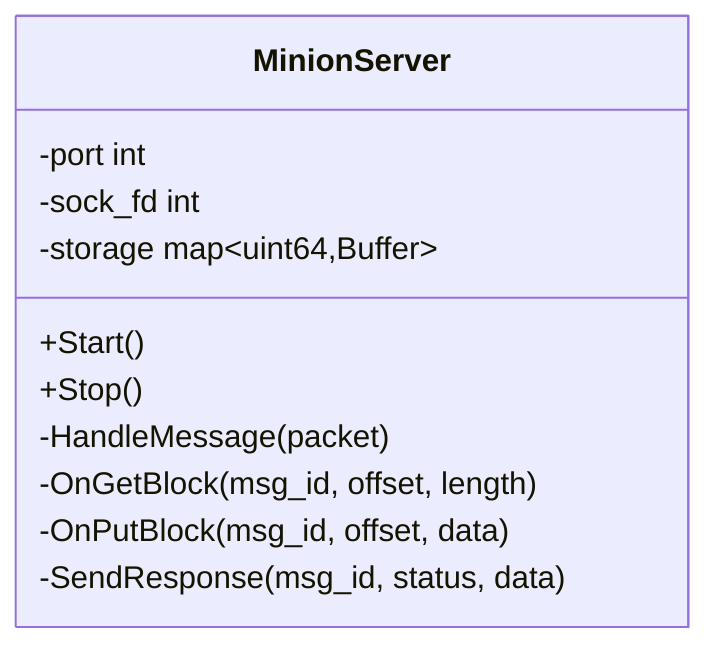
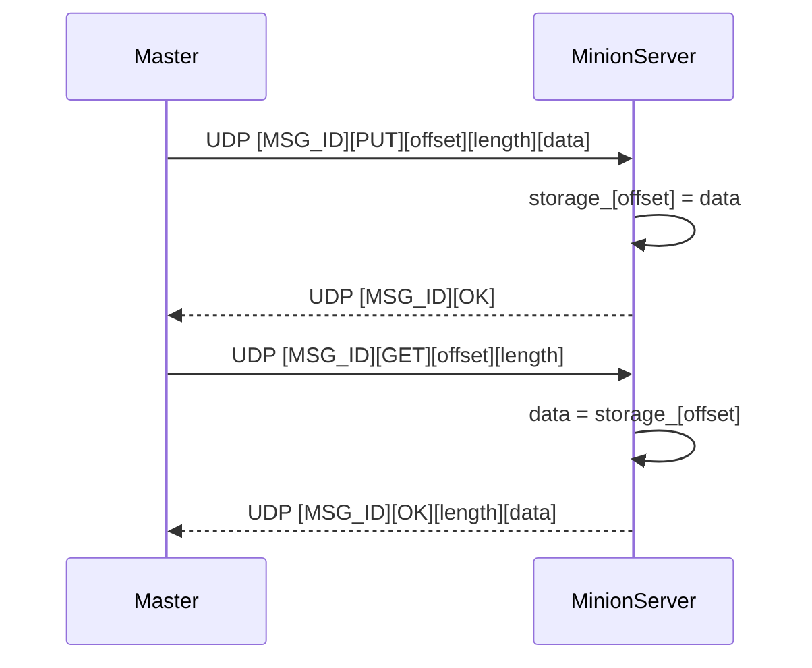

# Phase 4 — Minion Server

**Duration:** Week 4 | **Effort:** 12 hours | **Status:** ⏳ Not Started

---

## Goal

Implement the server that runs on each Raspberry Pi. This is intentionally simple — the master handles all the complexity. The minion just: receive command → execute → respond.

**Milestone:** Master sends GET/PUT to Minion → Minion stores/retrieves data → responds correctly.

---

## What the Minion Does

```
Listen on UDP port 9000
  └─→ Parse incoming packet
        ├─→ GET_BLOCK: read from local storage → send data back
        ├─→ PUT_BLOCK: write to local storage → send ACK back
        └─→ DELETE_BLOCK: delete from local storage → ACK
```

---

## Task 4.1 — MinionServer (12 hrs)

**Files:**
- `minion/include/MinionServer.hpp`
- `minion/src/MinionServer.cpp`
- `minion/src/minion_main.cpp`

---

## Class Design

```cpp
class MinionServer {
public:
    explicit MinionServer(int port);
    void Start();   // blocks, runs event loop
    void Stop();

private:
    void HandleMessage(const RawPacket& packet);
    void OnGetBlock(uint32_t msg_id, uint64_t offset, uint32_t length);
    void OnPutBlock(uint32_t msg_id, uint64_t offset, const Buffer& data);
    void OnDeleteBlock(uint32_t msg_id, uint64_t offset);
    void SendResponse(uint32_t msg_id, Status status, const Buffer& data = {});

    int                               port_;
    int                               sock_fd_;
    std::unordered_map<uint64_t, Buffer> storage_;   // block_id → data
};
```

---

## Class Diagram



---

## Message Handling Flow



---

## Local Storage Strategy

**Phase 4:** In-memory map (fast, simple):
```cpp
std::unordered_map<uint64_t, std::vector<char>> storage_;
```

**Production extension:** File-based storage (each block = a file):
```
/var/lds/blocks/
  ├── 0000000000000000   (block 0)
  ├── 0000000000000001   (block 1)
  └── ...
```

---

## Auto-Broadcast (for AutoDiscovery)

On startup, the Minion broadcasts itself so the Master can find it:

```cpp
// In MinionServer::Start():
while (true) {
    BroadcastHello();        // UDP broadcast every 5s
    std::this_thread::sleep_for(5s);
}
```

**Hello packet:**
```
[MSG_TYPE=HELLO][MINION_ID=42][PORT=9000][CAPACITY=1TB]
```

---

## Build & Run

```bash
# Build minion binary
cmake --build . --target minion

# Run on Raspberry Pi (port 9000, minion ID 1)
./minion --port 9000 --id 1

# Test from master machine
./test/integration/test_minion_comms --minion-ip 192.168.1.100 --port 9000
```

---

## Tests

- [ ] PUT_BLOCK → data stored in memory
- [ ] GET_BLOCK → correct data returned
- [ ] GET_BLOCK for missing block → error response
- [ ] MSG_ID preserved in response
- [ ] Master sends command → minion responds correctly (integration)

---

## Previous / Next

← [[Phase 3 - Reliability Features]]
→ [[Phase 5 - Integration & Testing]]
