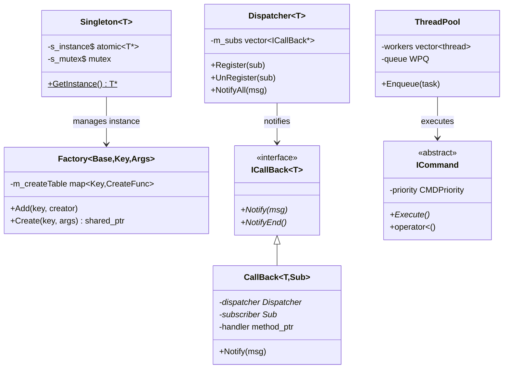
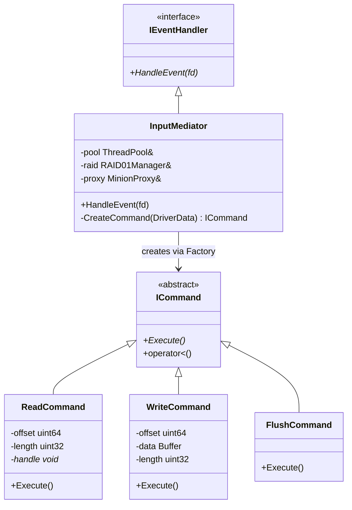
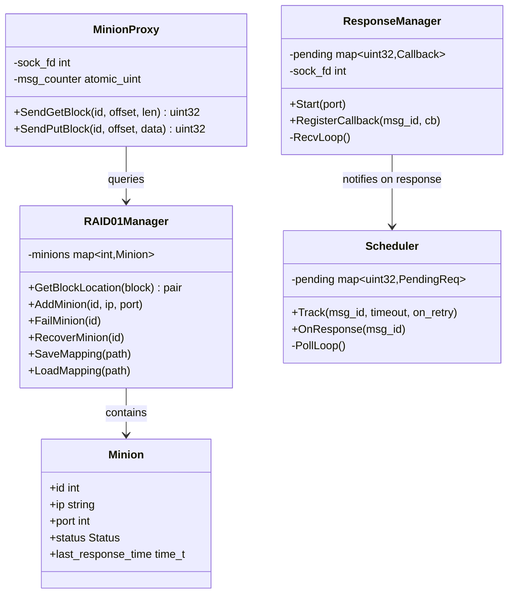
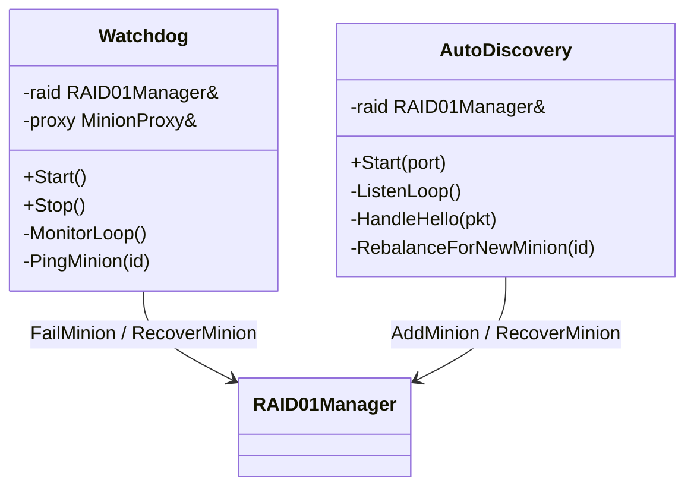
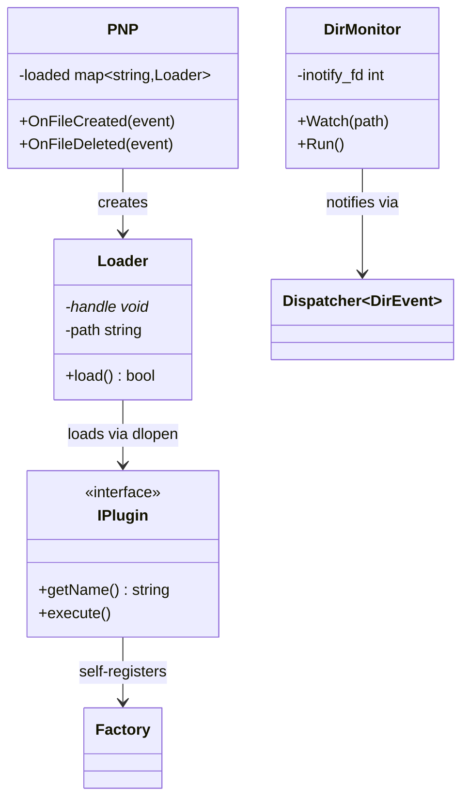

# Class Diagram — Full System

## Core Framework

```mermaid
classDiagram
    class Singleton~T~ {
        -s_instance$ atomic~T*~
        -s_mutex$ mutex
        +GetInstance()$ T*
    }
    class Factory~Base,Key,Args~ {
        -m_createTable map~Key,CreateFunc~
        +Add(key, creator)
        +Create(key, args) shared_ptr
    }
    class Dispatcher~T~ {
        -m_subs vector~ICallBack*~
        +Register(sub)
        +UnRegister(sub)
        +NotifyAll(msg)
    }
    class ICallBack~T~ {
        <<interface>>
        +Notify(msg)*
        +NotifyEnd()*
    }
    class CallBack~T,Sub~ {
        -dispatcher Dispatcher*
        -subscriber Sub*
        -handler method_ptr
        +Notify(msg)
    }
    class ThreadPool {
        -workers vector~thread~
        -queue WPQ
        +Enqueue(task)
    }
    class ICommand {
        <<abstract>>
        -priority CMDPriority
        +Execute()*
        +operator<()
    }

    Dispatcher --> ICallBack : notifies
    ICallBack <|-- CallBack
    Singleton --> Factory : manages instance
    ThreadPool --> ICommand : executes
```

---

## Phase 1 — Commands & Mediator

```mermaid
classDiagram
    class IEventHandler {
        <<interface>>
        +HandleEvent(fd)*
    }
    class InputMediator {
        -pool ThreadPool&
        -raid RAID01Manager&
        -proxy MinionProxy&
        +HandleEvent(fd)
        -CreateCommand(DriverData) ICommand
    }
    class ICommand {
        <<abstract>>
        +Execute()*
        +operator<()
    }
    class ReadCommand {
        -offset uint64
        -length uint32
        -handle void*
        +Execute()
    }
    class WriteCommand {
        -offset uint64
        -data Buffer
        -length uint32
        +Execute()
    }
    class FlushCommand {
        +Execute()
    }

    IEventHandler <|-- InputMediator
    ICommand <|-- ReadCommand
    ICommand <|-- WriteCommand
    ICommand <|-- FlushCommand
    InputMediator --> ICommand : creates via Factory
```

---

## Phase 2 — Storage & Network

```mermaid
classDiagram
    class RAID01Manager {
        -minions map~int,Minion~
        +GetBlockLocation(block) pair
        +AddMinion(id, ip, port)
        +FailMinion(id)
        +RecoverMinion(id)
        +SaveMapping(path)
        +LoadMapping(path)
    }
    class Minion {
        +id int
        +ip string
        +port int
        +status Status
        +last_response_time time_t
    }
    class MinionProxy {
        -sock_fd int
        -msg_counter atomic_uint
        +SendGetBlock(id, offset, len) uint32
        +SendPutBlock(id, offset, data) uint32
    }
    class ResponseManager {
        -pending map~uint32,Callback~
        -sock_fd int
        +Start(port)
        +RegisterCallback(msg_id, cb)
        -RecvLoop()
    }
    class Scheduler {
        -pending map~uint32,PendingReq~
        +Track(msg_id, timeout, on_retry)
        +OnResponse(msg_id)
        -PollLoop()
    }

    RAID01Manager --> Minion : contains
    MinionProxy --> RAID01Manager : queries
    ResponseManager --> Scheduler : notifies on response
```

---

## Phase 3 — Reliability

```mermaid
classDiagram
    class Watchdog {
        -raid RAID01Manager&
        -proxy MinionProxy&
        +Start()
        +Stop()
        -MonitorLoop()
        -PingMinion(id)
    }
    class AutoDiscovery {
        -raid RAID01Manager&
        +Start(port)
        -ListenLoop()
        -HandleHello(pkt)
        -RebalanceForNewMinion(id)
    }

    Watchdog --> RAID01Manager : FailMinion / RecoverMinion
    AutoDiscovery --> RAID01Manager : AddMinion / RecoverMinion
```

---

## Plugin System

```mermaid
classDiagram
    class DirMonitor {
        -inotify_fd int
        +Watch(path)
        +Run()
    }
    class PNP {
        -loaded map~string,Loader~
        +OnFileCreated(event)
        +OnFileDeleted(event)
    }
    class Loader {
        -handle void*
        -path string
        +load() bool
    }
    class IPlugin {
        <<interface>>
        +getName() string
        +execute()
    }

    DirMonitor --> Dispatcher~DirEvent~ : notifies via
    PNP --> Loader : creates
    Loader --> IPlugin : loads via dlopen
    IPlugin --> Factory : self-registers
```
