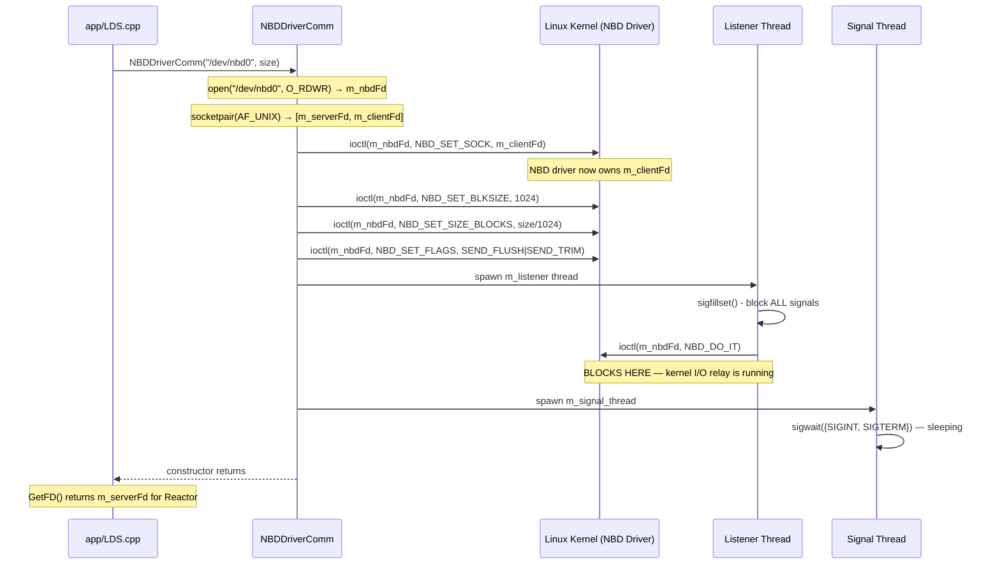
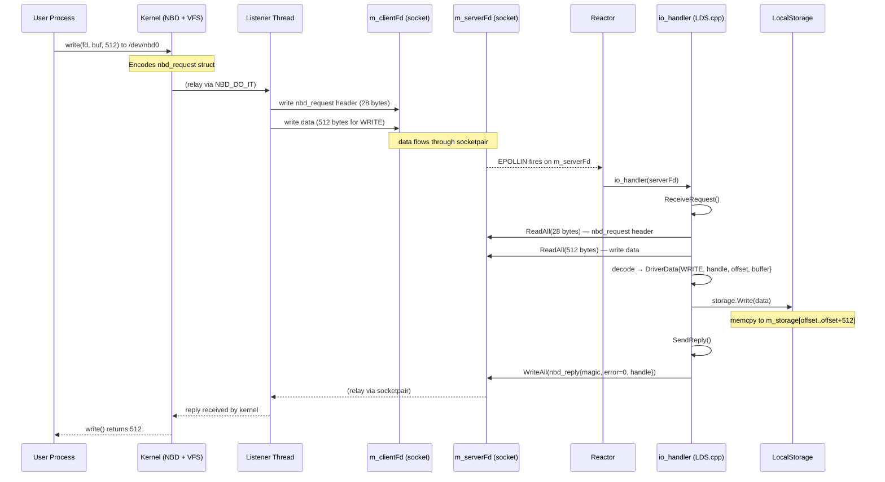
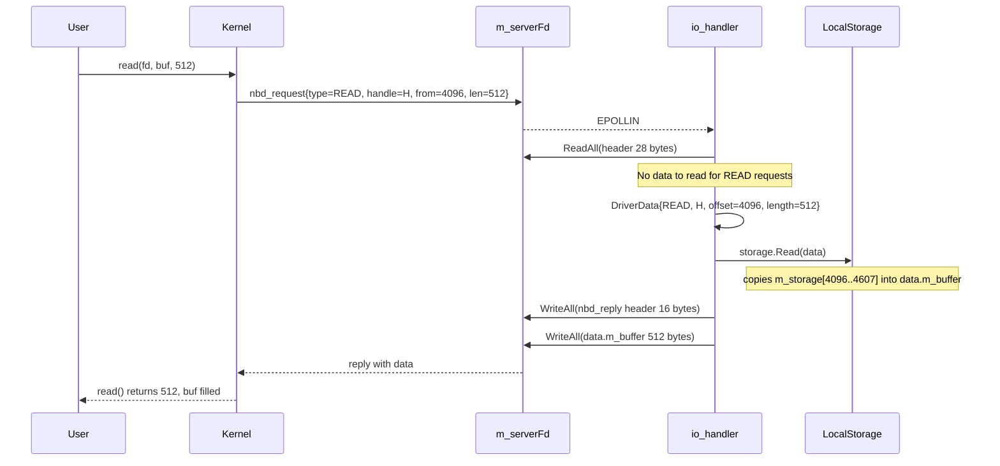
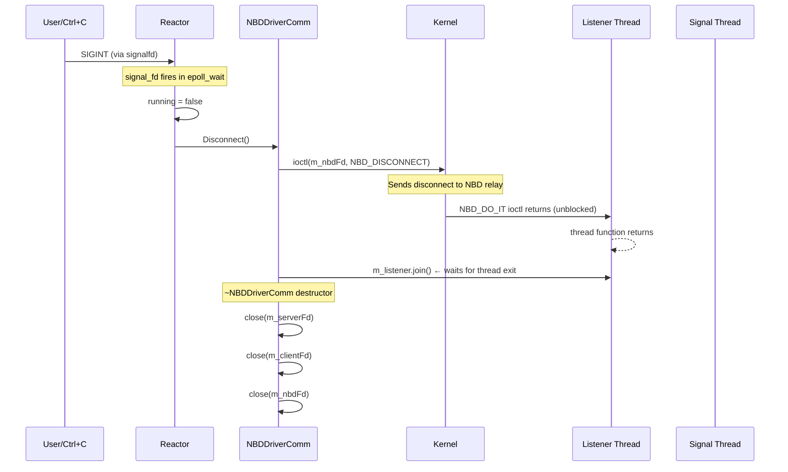
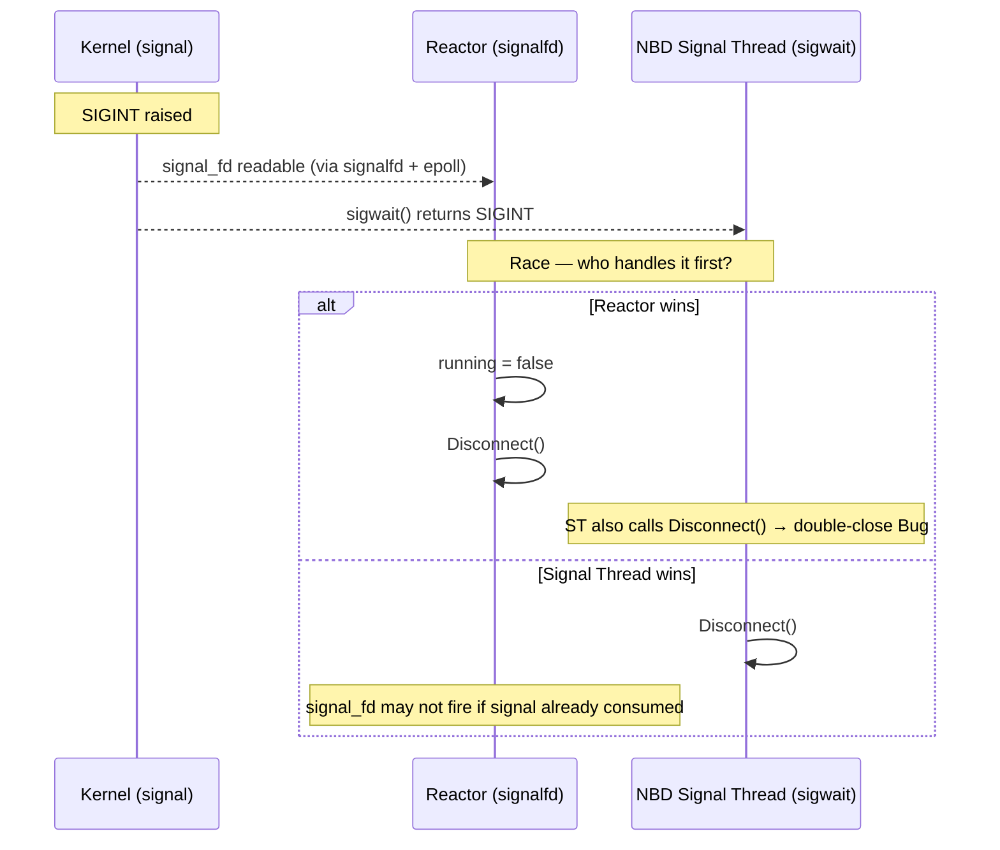

# Sequence Diagram — NBD Handshake & Request Handling

This diagram covers the full lifecycle: constructor setup, first request, and shutdown. Understanding this sequence is required for debugging NBD issues.

---

## Part 1: Constructor — Device Setup



---

## Part 2: Normal Request (Write)



---

## Part 3: Read Request



---

## Part 4: Shutdown



---

## Part 5: Signal Thread Conflict (Bug #7)



**Root cause:** Both `Reactor` (via `signalfd`) and `NBDDriverComm`'s signal thread (`sigwait`) are listening for the same signals. Linux will deliver each signal to only ONE of the two. This is a design conflict.

**Fix:** Remove `m_signal_thread` from `NBDDriverComm`. Reactor handles all signals. `Disconnect()` is called only from Reactor's `SIGINT` path. This is tracked as Bug #7.

---

## nbd_request / nbd_reply Structs (Wire Format)

```
nbd_request (kernel → userspace, 28 bytes):
  [4]  magic  = 0x25609513
  [4]  type   = 0=READ, 1=WRITE, 2=DISC, 3=FLUSH, 4=TRIM
  [8]  handle = opaque correlation ID (big-endian)
  [8]  from   = byte offset (big-endian)
  [4]  len    = data length (big-endian)
  --- followed by [len] bytes of data if type==WRITE ---

nbd_reply (userspace → kernel, 16 bytes):
  [4]  magic  = 0x67446698
  [4]  error  = 0 on success, errno on failure
  [8]  handle = copied unchanged from request
  --- followed by [len] bytes of data if replying to READ ---
```

All fields big-endian. `ReadAll`/`WriteAll` loops ensure full struct transfer despite partial socket reads.

---

## Related Notes
- [[NBD Protocol Deep Dive]]
- [[Request Lifecycle]]
- [[NBDDriverComm]]
- [[Known Bugs]]
- [[Reactor]]
