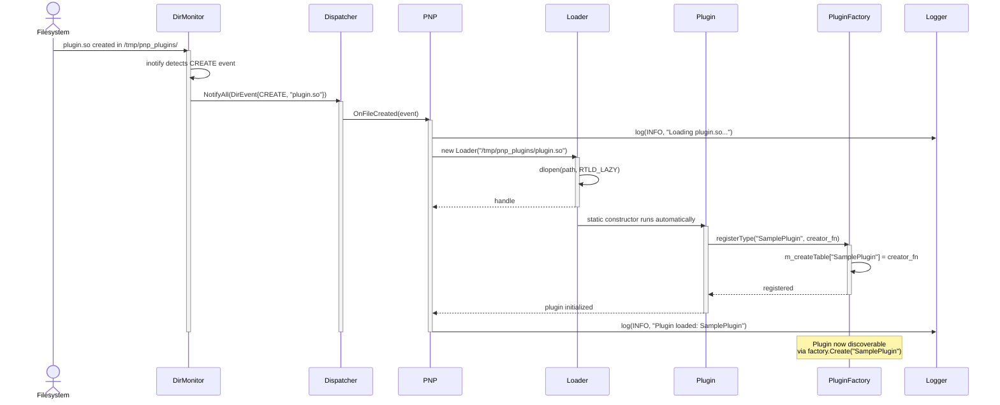
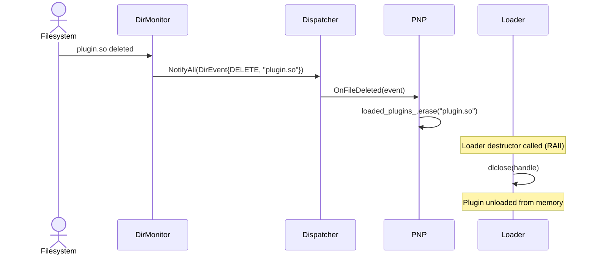
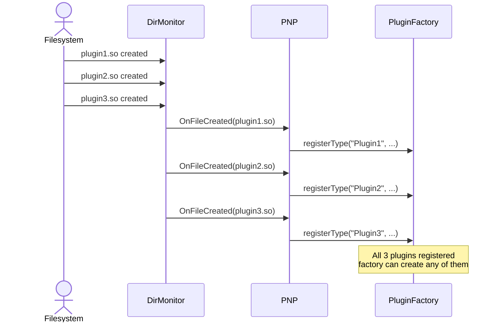

# Sequence Diagram — Plugin Loading

## Full Loading Sequence

```mermaid
sequenceDiagram
    actor FS as Filesystem
    participant DM as DirMonitor
    participant D as Dispatcher
    participant PNP
    participant L as Loader
    participant P as Plugin
    participant F as PluginFactory
    participant Log as Logger

    FS->>DM: plugin.so created in /tmp/pnp_plugins/
    activate DM
    DM->>DM: inotify detects CREATE event
    DM->>D: NotifyAll(DirEvent{CREATE, "plugin.so"})
    activate D
    D->>PNP: OnFileCreated(event)
    activate PNP
    PNP->>Log: log(INFO, "Loading plugin.so...")
    PNP->>L: new Loader("/tmp/pnp_plugins/plugin.so")
    activate L
    L->>L: dlopen(path, RTLD_LAZY)
    L-->>PNP: handle
    deactivate L
    L->>P: static constructor runs automatically
    activate P
    P->>F: registerType("SamplePlugin", creator_fn)
    activate F
    F->>F: m_createTable["SamplePlugin"] = creator_fn
    F-->>P: registered
    deactivate F
    P-->>PNP: plugin initialized
    deactivate P
    PNP->>Log: log(INFO, "Plugin loaded: SamplePlugin")
    deactivate PNP
    deactivate D
    deactivate DM

    Note over F: Plugin now discoverable<br/>via factory.Create("SamplePlugin")
```

---

## Unloading Sequence

```mermaid
sequenceDiagram
    actor FS as Filesystem
    participant DM as DirMonitor
    participant D as Dispatcher
    participant PNP
    participant L as Loader

    FS->>DM: plugin.so deleted
    DM->>D: NotifyAll(DirEvent{DELETE, "plugin.so"})
    D->>PNP: OnFileDeleted(event)
    PNP->>PNP: loaded_plugins_.erase("plugin.so")
    Note over L: Loader destructor called (RAII)
    L->>L: dlclose(handle)
    Note over L: Plugin unloaded from memory
```

---

## Multiple Plugins Loading in Parallel

```mermaid
sequenceDiagram
    actor FS as Filesystem
    participant DM as DirMonitor
    participant PNP
    participant F as PluginFactory

    FS->>DM: plugin1.so created
    FS->>DM: plugin2.so created
    FS->>DM: plugin3.so created

    DM->>PNP: OnFileCreated(plugin1.so)
    PNP->>F: registerType("Plugin1", ...)

    DM->>PNP: OnFileCreated(plugin2.so)
    PNP->>F: registerType("Plugin2", ...)

    DM->>PNP: OnFileCreated(plugin3.so)
    PNP->>F: registerType("Plugin3", ...)

    Note over F: All 3 plugins registered<br/>factory can create any of them
```
