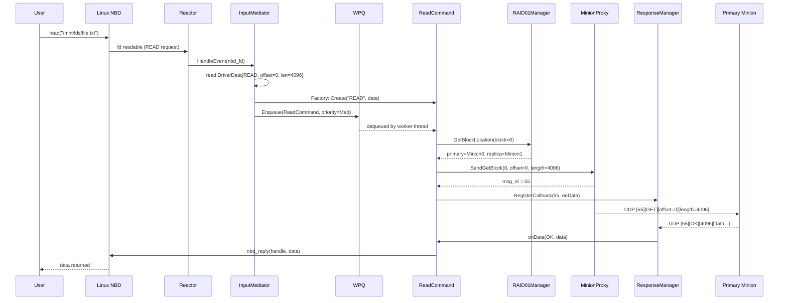
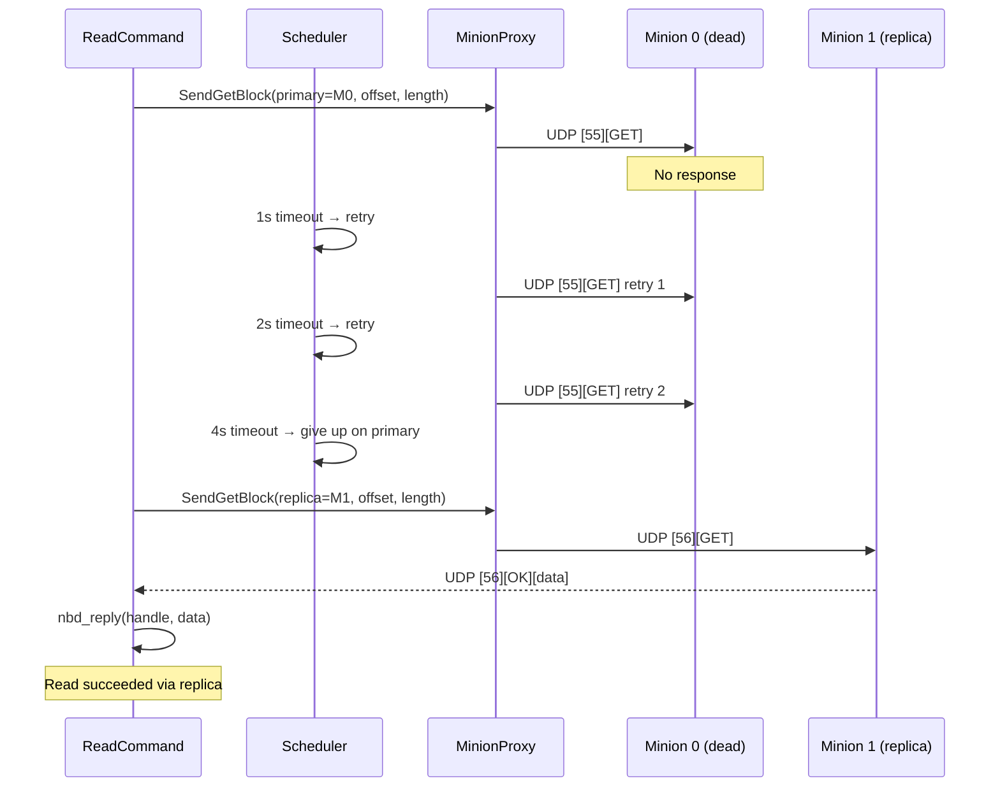

# Sequence Diagram — Read Request (End-to-End)

## Happy Path (primary minion responds)

```mermaid
sequenceDiagram
    participant User
    participant NBD as Linux NBD
    participant Reactor
    participant IM as InputMediator
    participant WPQ
    participant RC as ReadCommand
    participant RAID as RAID01Manager
    participant MP as MinionProxy
    participant RM as ResponseManager
    participant M as Primary Minion

    User->>NBD: read("/mnt/lds/file.txt")
    NBD->>Reactor: fd readable (READ request)
    Reactor->>IM: HandleEvent(nbd_fd)
    IM->>IM: read DriverData{READ, offset=0, len=4096}
    IM->>RC: Factory::Create("READ", data)
    IM->>WPQ: Enqueue(ReadCommand, priority=Med)
    WPQ-->>RC: dequeued by worker thread
    RC->>RAID: GetBlockLocation(block=0)
    RAID-->>RC: primary=Minion0, replica=Minion1
    RC->>MP: SendGetBlock(0, offset=0, length=4096)
    MP-->>RC: msg_id = 55
    RC->>RM: RegisterCallback(55, onData)
    MP->>M: UDP [55][GET][offset=0][length=4096]
    M-->>RM: UDP [55][OK][4096][data...]
    RM->>RC: onData(OK, data)
    RC->>NBD: nbd_reply(handle, data)
    NBD-->>User: data returned
```

---

## Fallback Path (primary fails → use replica)

```mermaid
sequenceDiagram
    participant RC as ReadCommand
    participant SCH as Scheduler
    participant MP as MinionProxy
    participant M0 as Minion 0 (dead)
    participant M1 as Minion 1 (replica)

    RC->>MP: SendGetBlock(primary=M0, offset, length)
    MP->>M0: UDP [55][GET]
    Note over M0: No response

    SCH->>SCH: 1s timeout → retry
    MP->>M0: UDP [55][GET] retry 1
    SCH->>SCH: 2s timeout → retry
    MP->>M0: UDP [55][GET] retry 2
    SCH->>SCH: 4s timeout → give up on primary

    RC->>MP: SendGetBlock(replica=M1, offset, length)
    MP->>M1: UDP [56][GET]
    M1-->>RC: UDP [56][OK][data]
    RC->>RC: nbd_reply(handle, data)
    Note over RC: Read succeeded via replica
```
