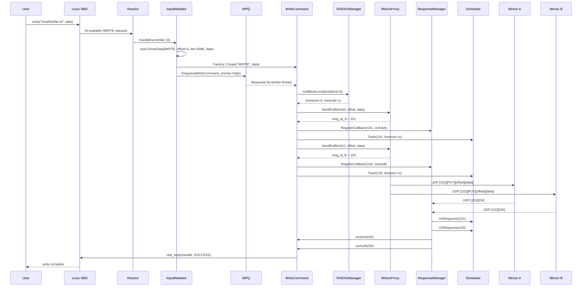
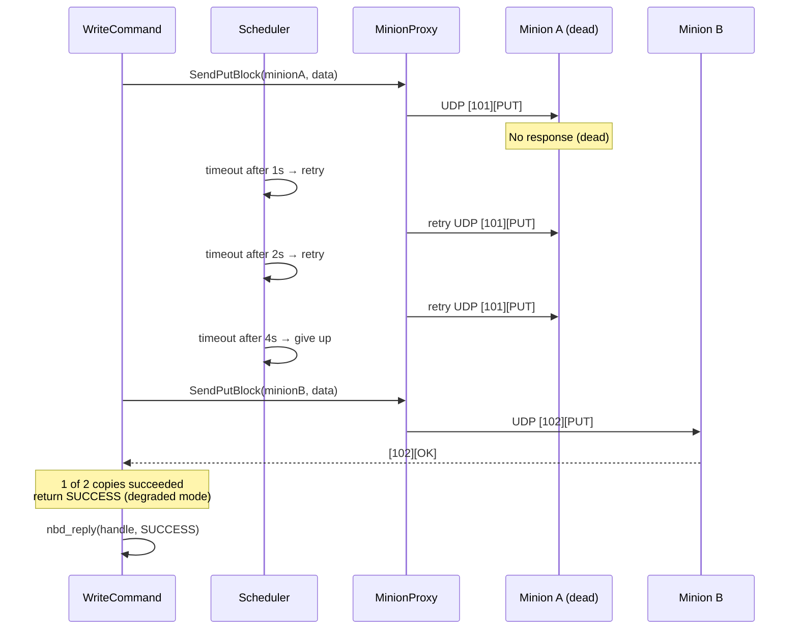

# Sequence Diagram — Write Request (End-to-End)

## Happy Path (both minions respond)

```mermaid
sequenceDiagram
    participant User
    participant NBD as Linux NBD
    participant Reactor
    participant IM as InputMediator
    participant WPQ
    participant WC as WriteCommand
    participant RAID as RAID01Manager
    participant MP as MinionProxy
    participant RM as ResponseManager
    participant SCH as Scheduler
    participant MA as Minion A
    participant MB as Minion B

    User->>NBD: write("/mnt/lds/file.txt", data)
    NBD->>Reactor: fd readable (WRITE request)
    Reactor->>IM: HandleEvent(nbd_fd)
    IM->>IM: read DriverData{WRITE, offset=0, len=4096, data}
    IM->>WC: Factory::Create("WRITE", data)
    IM->>WPQ: Enqueue(WriteCommand, priority=High)
    WPQ-->>WC: dequeued by worker thread
    WC->>RAID: GetBlockLocation(block=0)
    RAID-->>WC: (minionA=0, minionB=1)
    WC->>MP: SendPutBlock(0, offset, data)
    MP-->>WC: msg_id_A = 101
    WC->>RM: RegisterCallback(101, onAckA)
    WC->>SCH: Track(101, timeout=1s)
    WC->>MP: SendPutBlock(1, offset, data)
    MP-->>WC: msg_id_B = 102
    WC->>RM: RegisterCallback(102, onAckB)
    WC->>SCH: Track(102, timeout=1s)
    MP->>MA: UDP [101][PUT][offset][data]
    MP->>MB: UDP [102][PUT][offset][data]
    MA-->>RM: UDP [101][OK]
    MB-->>RM: UDP [102][OK]
    RM->>SCH: OnResponse(101)
    RM->>SCH: OnResponse(102)
    RM->>WC: onAckA(OK)
    RM->>WC: onAckB(OK)
    WC->>NBD: nbd_reply(handle, SUCCESS)
    NBD-->>User: write complete
```

---

## Degraded Path (one minion fails)

```mermaid
sequenceDiagram
    participant WC as WriteCommand
    participant SCH as Scheduler
    participant MP as MinionProxy
    participant MA as Minion A (dead)
    participant MB as Minion B

    WC->>MP: SendPutBlock(minionA, data)
    MP->>MA: UDP [101][PUT]
    Note over MA: No response (dead)
    SCH->>SCH: timeout after 1s → retry
    MP->>MA: retry UDP [101][PUT]
    SCH->>SCH: timeout after 2s → retry
    MP->>MA: retry UDP [101][PUT]
    SCH->>SCH: timeout after 4s → give up

    WC->>MP: SendPutBlock(minionB, data)
    MP->>MB: UDP [102][PUT]
    MB-->>WC: [102][OK]
    Note over WC: 1 of 2 copies succeeded<br/>return SUCCESS (degraded mode)
    WC->>WC: nbd_reply(handle, SUCCESS)
```
