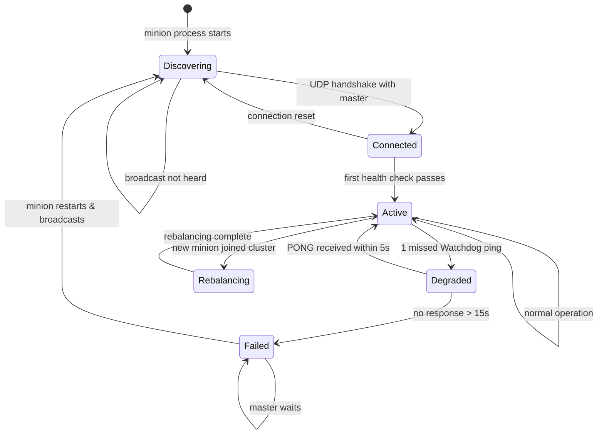
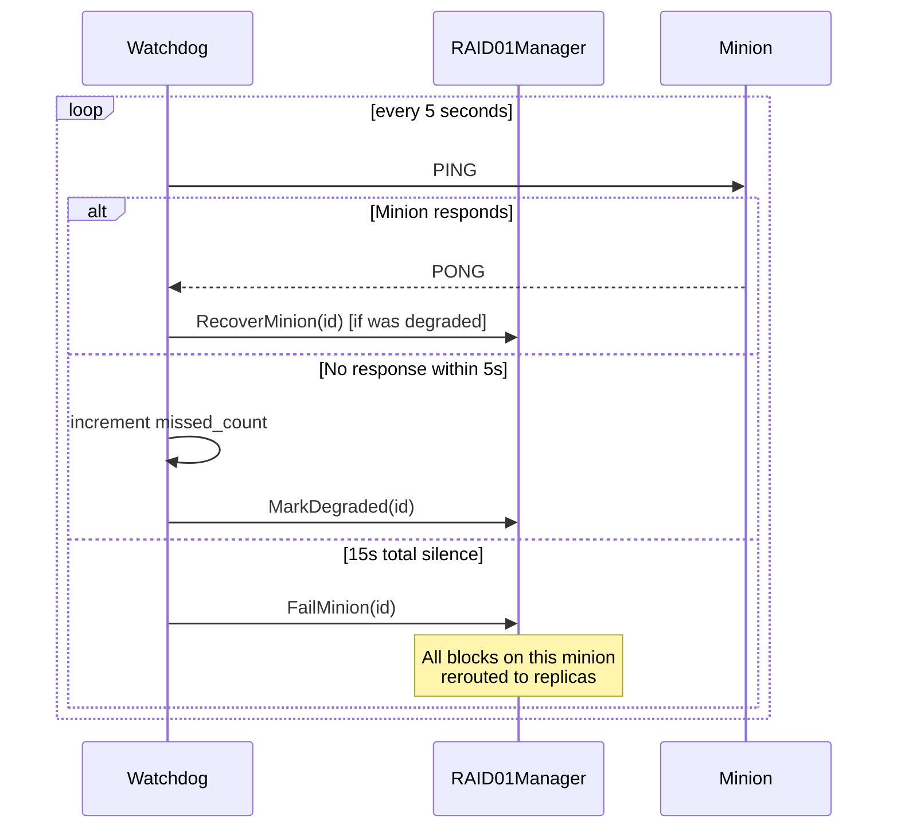
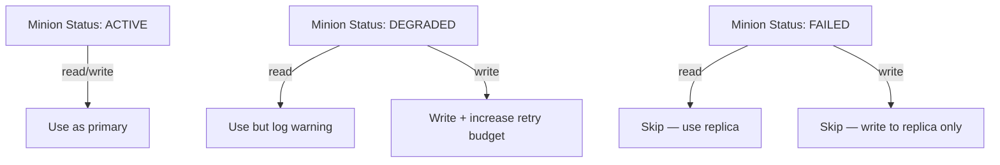

# State Diagram — Minion Lifecycle

## States

---

## State Descriptions

| State | Meaning | Impact on I/O |
|---|---|---|
| **Discovering** | Broadcasting Hello, waiting for master | No I/O |
| **Connected** | Master knows about minion | No I/O yet |
| **Active** | Fully operational, passes health checks | Reads + writes |
| **Degraded** | Missed a ping, might be slow | Still used, monitored closely |
| **Failed** | No response for 15s | Excluded from all I/O |
| **Rebalancing** | Receiving blocks from other minions | Limited I/O (background copy) |

---

## Watchdog Perspective

---

## Master Perspective on Minion States

