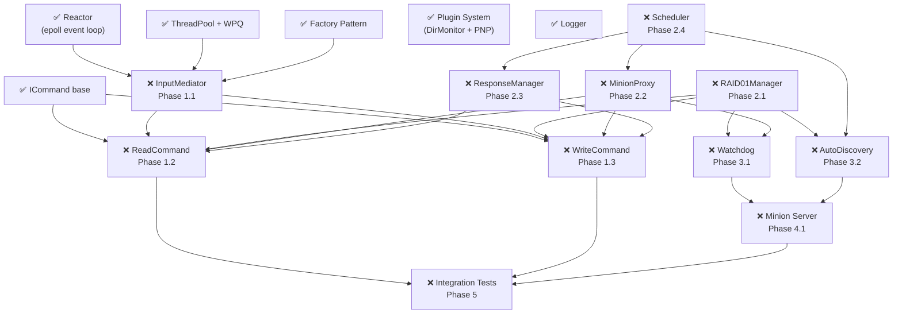

# Phase Dependencies

## Full Dependency Graph



---

## Critical Path

The longest chain of dependencies (must be done in order):

```
Reactor → InputMediator → ReadCommand
                        → RAID01Manager → Watchdog    → Minion Server → Integration Tests
                        → MinionProxy   → Scheduler   
                        → ResponseManager → AutoDiscovery
```

**Start with InputMediator.** Everything else follows.

---

## What You Can Mock

To unblock Phase 1 before Phase 2 is complete:

| Component | Mock Strategy |
|---|---|
| RAID01Manager | `FakeRAID` always returns `{minion0, minion1}` |
| MinionProxy | `FakeProxy` records calls, no UDP |
| ResponseManager | `FakeRM` immediately calls registered callback |
| Scheduler | `FakeScheduler` no-op track/OnResponse |

This lets you build and test InputMediator + ReadCommand + WriteCommand before the network layer exists.
